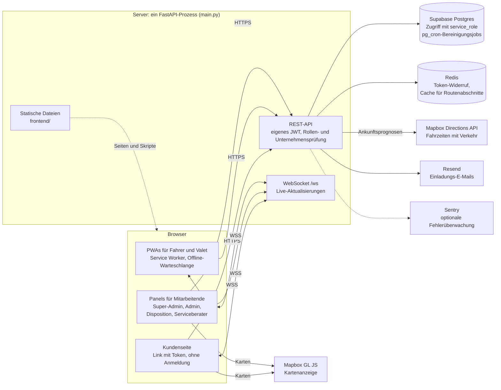

# Shuttle & Valet Ops

[](https://github.com/atilbarslan/shuttle-valet-ops/actions/workflows/ci.yml)

Entwickelt von Atıl Arslan unter dem Namen Paxroute, 2026.

[English](README.md) · **Deutsch**

Eine Webanwendung zur Steuerung zweier Arten von Beförderungsbetrieb. Im Shuttle erhält der Fahrer
eine geordnete Route, und die Fahrgäste sehen, in wie vielen Minuten das Fahrzeug ankommt. Im
Valet-Service wird das Auto eines Kunden an seiner Haustür abgeholt, in die Werkstatt gebracht und
nach getaner Arbeit wieder an die Tür zurückgebracht. In beiden Modulen installiert der Kunde
nichts: Er markiert über einen Link seinen Standort oder seine Haltestelle und sieht die
Ankunftsprognose. Das Unternehmen, das den Betrieb führt, verfolgt ihn über ein Panel.

Beide Module wurden auf einem Produktionsserver in einen lauffähigen Zustand gebracht:

- **Shuttle:** Personalbeförderung. Funktioniert mit festen Haltestellen und Routen oder von Tür zu
  Tür; eine geordnete Route für den Fahrer, eine Ankunftsprognose für den Fahrgast.
- **Valet:** Das Auto wird an der Tür des Kunden abgeholt, in die Werkstatt gebracht und nach
  getaner Arbeit wieder an die Tür zurückgebracht.

Ein Unternehmen kann eines der beiden Module nutzen oder beide. Die Module werden unabhängig
voneinander ein- und ausgeschaltet und haben getrennte Kontingente.

Das Produkt wurde für den türkischen Markt gebaut: Die Oberfläche ist türkisch, und der Umgang mit
personenbezogenen Daten folgt dem KVKK, dem türkischen Datenschutzgesetz. Codekommentare sind
englisch; Bezeichner (Variablen, Funktionen, Tabellen, Spalten) sind türkisch, ebenso die Meldungen,
die der Nutzer sieht.

Dies ist ein Ein-Personen-Projekt. Das Repository wurde weniger veröffentlicht, um das Produkt zu
zeigen, als um die Entscheidungen dahinter und ihre Gründe zu zeigen. Die Dokumente unter `docs/`
versuchen, die Frage „Warum haben wir es so gemacht?“ zu beantworten, nicht „Was haben wir
gemacht?“. Einige beschreiben Dinge, die beim ersten Mal falsch gemacht und später korrigiert
wurden; der Grund für eine Entscheidung wurde oft erst bei dieser Korrektur deutlich.

**Status:** Ein-Personen-Projekt, entwickelt 03.2026–10.2026. Das Produkt ging auf einem
Produktivserver live und wurde interessierten Unternehmen vorgeführt; kein Unternehmen hat es im
Betrieb eingesetzt, und es wurde eingestellt, weil es keine Kunden fand. Der Server ist
abgeschaltet, daher gibt es keine Live-Instanz zum Ausprobieren. Das Repository wurde aus
Sicherheitsgründen mit einer sauberen Historie veröffentlicht: Der Code wurde in ein neues
Repository kopiert, die Entwicklungshistorie wurde nicht veröffentlicht.

## Bildschirmfotos

Die Oberfläche ist auf Türkisch. Die Bildschirmfotos stammen aus der Live-Version, die unter dem Namen Paxroute lief; Name und Logo wurden aus dieser Codebasis entfernt. Sie zeigen Demodaten; Telefonnummern und Kennzeichen sind unkenntlich gemacht.

| | |
|---|---|
| <br>**Fahrer (PWA):** geordnete Route | <br>**Valet (PWA):** aktueller Auftrag |
| <br>**Kunde:** Haltestelle wählen | <br>**Kunde:** Ankunftsprognose |
| <br>**Dispositions-Panel** | <br>**Serviceberater-Panel:** Valet-Aufträge |
| <br>**Berichte:** zugesagte und tatsächliche Zeiten je Valet (siehe [Ehrliche Messung](docs/DECISIONS.de.md#ehrliche-messung)) |  |

---

## Architektur

Alles läuft in einem einzigen FastAPI-Prozess, der die API, den WebSocket und die Frontend-Dateien
ausliefert. Der Browser spricht nur zum Zeichnen der Karten direkt mit Mapbox; Fahrzeiten fragt der
Server ab.



---

## Technologie

| Schicht | Wahl | Warum |
|---|---|---|
| Backend | FastAPI (Python 3.12) | Asynchron, Validierung über Typ-Hinweise, schnelles Vorankommen in einer Datei |
| Datenbank | Supabase (Postgres) | Verwaltetes Postgres; `pg_cron` für geplante Jobs |
| Identität | Eigenes JWT-System | Das Modell von Supabase Auth passte nicht zur Rollenhierarchie und zur Mandantentrennung |
| Cache | Redis | Prüfungen auf Token-Widerruf und Unternehmensstatus, Fahrzeiten |
| Echtzeit | FastAPI WebSocket | Keine separate Dienstschicht nötig |
| Karten und Routing | Mapbox (GL JS + Directions) | Fahrzeiten mit Verkehrsdaten |
| Frontend | Reines HTML + JavaScript | Kein Build-Schritt |
| Bildschirme im Feld | PWA + Service Worker | Auch ohne Netzabdeckung weiterarbeiten |
| XSS-Schutz | DOMPurify (lokal ausgeliefert) | Keine Abhängigkeit von einem externen CDN |

---

## Lokal ausführen

Voraussetzungen: Python 3.12, ein Supabase-Projekt (Postgres), Redis, ein Mapbox-Konto und ein
Resend-Konto für den E-Mail-Versand.

```bash
python3.12 -m venv .venv && source .venv/bin/activate
pip install -r requirements.txt
cp .env.example .env    # Werte eintragen
uvicorn main:app --reload
```

Datenbankschema, geplante Jobs, Seiten mit Datenschutzhinweisen, Hinweise für den Produktivbetrieb und Tests stehen in [docs/SETUP.de.md](docs/SETUP.de.md).

---

## Dokumentation

| Dokument | Inhalt |
|---|---|
| [docs/ARCHITECTURE.de.md](docs/ARCHITECTURE.de.md) | Code-Struktur, Valet-Zustandsautomat, Shuttle-Routenreihenfolge und Ankunftsprognosen, Offline-Warteschlange, Konsistenz, Redis-Verkehr |
| [docs/DECISIONS.de.md](docs/DECISIONS.de.md) | Warum es so gebaut wurde, ehrliche Messung, was es bewusst nicht tut, bekannte Grenzen |
| [docs/SECURITY-PRIVACY.de.md](docs/SECURITY-PRIVACY.de.md) | Identität und Trennung, Sicherheitsmaßnahmen, was bei Ausfall durchlässt und was sperrt, Umgang mit Daten nach dem KVKK |
| [docs/SETUP.de.md](docs/SETUP.de.md) | Vollständige Einrichtung: Umgebung, Datenbank, Datenschutzseiten, Produktivbetrieb, Tests |
| [docs/PERFORMANCE.md](docs/PERFORMANCE.md) | Lasttest der blockierenden Datenbankaufrufe, vor und nach der Korrektur (Englisch) |

Zwei gute Einstiegspunkte: die [Offline-Warteschlange](docs/ARCHITECTURE.de.md#bedingungen-im-feld-pwa-und-offline-warteschlange),
die die Arbeit weiterlaufen lässt, wenn im Feld die Verbindung abreißt, und der
[Valet-Zustandsautomat](docs/ARCHITECTURE.de.md#valet-ablauf-zustandsautomat), dessen Reihenfolge vom Auftragstyp abhängt.

---

## Lizenz

Alle Rechte vorbehalten. Der Code ist zur Ansicht als Portfolio veröffentlicht; siehe `LICENSE`.
Komponenten von Drittanbietern behalten ihre eigenen Lizenzen.
