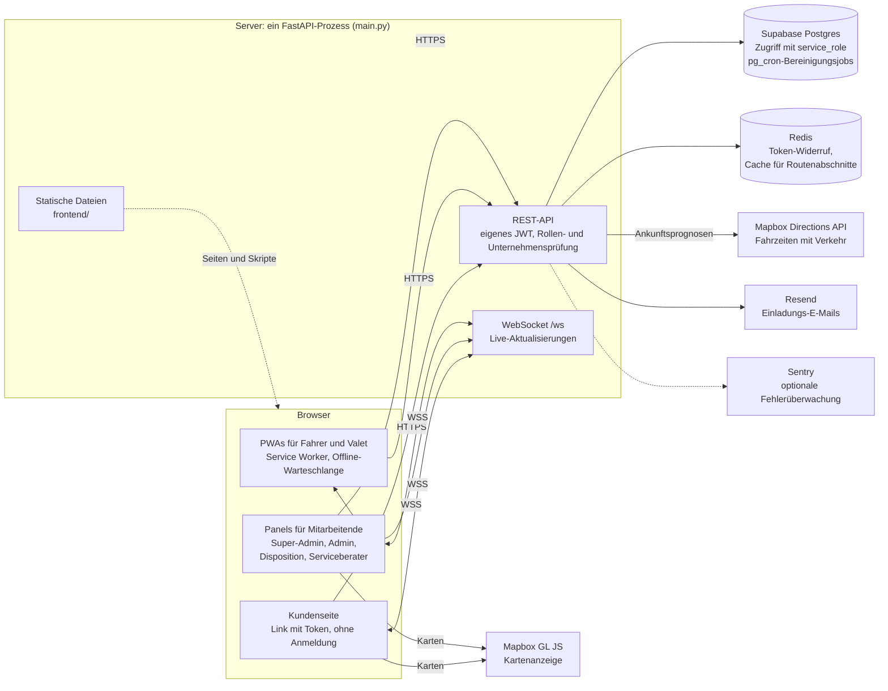

# Shuttle & Valet Ops

[](https://github.com/atilbarslan/shuttle-valet-ops/actions/workflows/ci.yml)

Entwickelt von Atıl Arslan unter dem Namen Paxroute, 2026.

[English](README.md) · **Deutsch**

Eine Webanwendung zur Steuerung zweier Arten von Beförderungsbetrieb. Im Shuttle erhält der Fahrer
eine geordnete Route, und die Fahrgäste sehen, in wie vielen Minuten das Fahrzeug ankommt. Im
Valet-Service wird das Auto eines Kunden an seiner Haustür abgeholt, in die Werkstatt gebracht und
nach getaner Arbeit wieder an die Tür zurückgebracht. In beiden Modulen installiert der Kunde
nichts: Er markiert über einen Link seinen Standort oder seine Haltestelle und sieht die
Ankunftsprognose. Das Unternehmen, das den Betrieb führt, verfolgt ihn über ein Panel.

Beide Module wurden auf einem Produktionsserver in einen lauffähigen Zustand gebracht:

- **Shuttle:** Personalbeförderung. Funktioniert mit festen Haltestellen und Routen oder von Tür zu
  Tür; eine geordnete Route für den Fahrer, eine Ankunftsprognose für den Fahrgast.
- **Valet:** Das Auto wird an der Tür des Kunden abgeholt, in die Werkstatt gebracht und nach
  getaner Arbeit wieder an die Tür zurückgebracht.

Ein Unternehmen kann eines der beiden Module nutzen oder beide. Die Module werden unabhängig
voneinander ein- und ausgeschaltet und haben getrennte Kontingente.

Das Produkt wurde für den türkischen Markt gebaut: Die Oberfläche ist türkisch, und der Umgang mit
personenbezogenen Daten folgt dem KVKK, dem türkischen Datenschutzgesetz. Codekommentare sind
englisch; Bezeichner (Variablen, Funktionen, Tabellen, Spalten) sind türkisch, ebenso die Meldungen,
die der Nutzer sieht.

Dies ist ein Ein-Personen-Projekt. Das Repository wurde weniger veröffentlicht, um das Produkt zu
zeigen, als um die Entscheidungen dahinter und ihre Gründe zu zeigen. Die folgenden Abschnitte
versuchen, die Frage „Warum haben wir es so gemacht?“ zu beantworten, nicht „Was haben wir
gemacht?“. Einige beschreiben Dinge, die beim ersten Mal falsch gemacht und später korrigiert
wurden; der Grund für eine Entscheidung wurde oft erst bei dieser Korrektur deutlich.

**Status:** Ein-Personen-Projekt, entwickelt 03.2026–10.2026. Das Produkt ging auf einem
Produktivserver live und wurde interessierten Unternehmen vorgeführt; kein Unternehmen hat es im
Betrieb eingesetzt, und es wurde eingestellt, weil es keine Kunden fand. Der Server ist
abgeschaltet, daher gibt es keine Live-Instanz zum Ausprobieren. Das Repository wurde aus
Sicherheitsgründen mit einer sauberen Historie veröffentlicht: Der Code wurde in ein neues
Repository kopiert, die Entwicklungshistorie wurde nicht veröffentlicht.

Zwei gute Einstiegspunkte: die [Offline-Warteschlange](#bedingungen-im-feld-pwa-und-offline-warteschlange),
die die Arbeit weiterlaufen lässt, wenn im Feld die Verbindung abreißt, und der
[Valet-Zustandsautomat](#valet-ablauf-zustandsautomat), dessen Reihenfolge vom Auftragstyp abhängt.

---

## Inhalt

1. [Technologie](#technologie)
2. [Architektur](#architektur)
3. [Bildschirmfotos](#bildschirmfotos)
4. [Projektstruktur](#projektstruktur)
5. [Identität, Berechtigungen und Isolation](#identität-berechtigungen-und-isolation)
6. [Valet-Ablauf: Zustandsautomat](#valet-ablauf-zustandsautomat)
7. [Ehrliche Messung](#ehrliche-messung)
8. [Shuttle: Routenreihenfolge und Ankunftsprognose](#shuttle-routenreihenfolge-und-ankunftsprognose)
9. [Bedingungen im Feld: PWA und Offline-Warteschlange](#bedingungen-im-feld-pwa-und-offline-warteschlange)
10. [Konsistenz: Idempotenz statt Atomarität](#konsistenz-idempotenz-statt-atomarität)
11. [Performance: weniger Redis-Verkehr](#performance-weniger-redis-verkehr)
12. [Sicherheit](#sicherheit)
13. [Fehlerbehandlung: was bei Ausfall durchlässt und was sperrt](#fehlerbehandlung-was-bei-ausfall-durchlässt-und-was-sperrt)
14. [KVKK: Datenhygiene von Anfang an](#kvkk-datenhygiene-von-anfang-an)
15. [Was es nicht tut](#was-es-nicht-tut)
16. [Bekannte Grenzen](#bekannte-grenzen)
17. [Einrichtung](#einrichtung)
18. [Lizenz](#lizenz)

---

## Technologie

| Schicht | Wahl | Warum |
|---|---|---|
| Backend | FastAPI (Python 3.12) | Asynchron, Validierung über Typ-Hinweise, schnelles Vorankommen in einer Datei |
| Datenbank | Supabase (Postgres) | Verwaltetes Postgres; `pg_cron` für geplante Jobs |
| Identität | Eigenes JWT-System | Das Modell von Supabase Auth passte nicht zur Rollenhierarchie und zur Mandantentrennung |
| Cache | Redis | Prüfungen auf Token-Widerruf und Unternehmensstatus, Fahrzeiten |
| Echtzeit | FastAPI WebSocket | Keine separate Dienstschicht nötig |
| Karten und Routing | Mapbox (GL JS + Directions) | Fahrzeiten mit Verkehrsdaten |
| Frontend | Reines HTML + JavaScript | Kein Build-Schritt |
| Bildschirme im Feld | PWA + Service Worker | Auch ohne Netzabdeckung weiterarbeiten |
| XSS-Schutz | DOMPurify (lokal ausgeliefert) | Keine Abhängigkeit von einem externen CDN |

---

## Architektur

Alles läuft in einem einzigen FastAPI-Prozess, der die API, den WebSocket und die Frontend-Dateien
ausliefert. Der Browser spricht nur zum Zeichnen der Karten direkt mit Mapbox; Fahrzeiten fragt der
Server ab.



---

## Bildschirmfotos

Die Oberfläche ist auf Türkisch. Die Bildschirmfotos stammen aus der Live-Version, die unter dem Namen Paxroute lief; Name und Logo wurden aus dieser Codebasis entfernt. Sie zeigen Demodaten; Telefonnummern und Kennzeichen sind unkenntlich gemacht.

| | |
|---|---|
| <br>**Fahrer (PWA):** geordnete Route | <br>**Valet (PWA):** aktueller Auftrag |
| <br>**Kunde:** Haltestelle wählen | <br>**Kunde:** Ankunftsprognose |
| <br>**Dispositions-Panel** | <br>**Serviceberater-Panel:** Valet-Aufträge |
| <br>**Berichte:** zugesagte und tatsächliche Zeiten je Valet (siehe [Ehrliche Messung](#ehrliche-messung)) |  |

---

## Projektstruktur

```
main.py                Das gesamte Backend: Endpunkte, Authentifizierung, Hilfsfunktionen
requirements.txt
requirements-dev.txt   Entwicklungswerkzeuge: pytest, ruff, fakeredis
tests/                 Unit- und Endpunkt-Tests (In-Memory-Datenbank, fakeredis)
frontend/
  <seite>.html         Eine Seite pro Rolle
  js/<seite>.js        Das einzige Skript dieser Seite
  js/surum-kontrol.js  Hinweis „neue Version“ in den Panels ohne PWA
  config.js            Gemeinsame Einstellungen (API-Adresse, Abmelden)
  sw.js                Service Worker; einzige Quelle der Versionsnummer
  manifest.json        PWA-Manifest
  libs/purify.min.js
  fonts/
db/                    Basisschema, Migrationen und geplante Jobs (SQL)
scripts/load_test.py   Kleiner Lasttest (siehe docs/PERFORMANCE.md)
docs/                  Performance-Notizen und Bildschirmfotos
```

Die Seiten sind nach Rollen getrennt: Super-Admin, Unternehmens-Admin, Disposition,
Serviceberater, Fahrer, Valet, Kunde. Die Bildschirme für Fahrer und Valet sind PWAs; die übrigen
sind normale Web-Panels.

### Warum ein Backend in einer einzigen Datei

Das Backend steckt in einer einzigen `main.py`. Für einen einzelnen Entwickler war das Suchen und
Bearbeiten in einer Datei schneller als das Springen zwischen Modulen. Der Hauptnutzen einer
Aufteilung ist, dass mehrere Personen gleichzeitig daran arbeiten können; dieser Bedarf entstand
nie.

### Warum kein Build-Schritt

Es gibt pro Seite eine HTML- und eine JavaScript-Datei; kein Framework und kein Bundler. Die Datei,
die läuft, ist die Datei, die geschrieben wurde. Der Preis dafür ist doppelter Code
([Bekannte Grenzen](#bekannte-grenzen)).

---

## Identität, Berechtigungen und Isolation

### Supabase, aber nicht Supabase Auth

Die Datenbank ist Supabase; die Authentifizierung ist unser eigenes JWT-System. Der Grund sind eine
Hierarchie mit sechs Rollen und die Mandantentrennung: Bei jeder Anfrage werden Rolle und
Unternehmen getrennt geprüft, und wir brauchten volle Kontrolle über den Token-Widerruf.

Das Backend verbindet sich mit dem Schlüssel mit den meisten Rechten zur Datenbank; Row Level
Security greift nicht, und alle Berechtigungsprüfungen liegen im Anwendungscode. Das ist bewusst
so: Die Berechtigungslogik ist nicht über Datenbank-Policies verstreut, sondern steht lesbar im
Anwendungscode.

### Rollenhierarchie

```
SUPER-ADMIN  >  ADMIN  >  DISPOSITION  >  SERVICEBERATER  >  FAHRER = VALET
                                                             KUNDE (kein Login, nur Token)
```

Ein Nutzer kann nur jemanden unterhalb seiner eigenen Ebene verwalten. Die einzige Ausnahme ist die
Delegation: Ein Admin kann einen weiteren Admin anlegen, dessen Zuständigkeit enger ist als seine
eigene (an eine Filiale oder eine Marke gebunden). So legt die Zentrale einen Filial-Admin an und
ein Filial-Admin einen Marken-Admin.

Fahrer und Valet sind Feldrollen auf derselben Ebene. Eine Route ansehen, starten und beenden,
Haltestellen-Vorgänge und Fahrgast-Vorgänge sind nur am eigenen Fahrzeug erlaubt.

Diese Regel kam erst später hinzu: Ein Audit ergab, dass ein Valet die Routenliste der
Shuttle-Fahrzeuge im eigenen Unternehmen abrufen und dabei personenbezogene Daten der Fahrgäste
sehen konnte. Beide Feldrollen wurden an dieselbe Prüfung „Ist das dein Fahrzeug?“ gebunden. Eine
spätere Durchsicht ergab, dass die drei Fahrgast-Endpunkte (abgeholt, abgesetzt, nicht erschienen)
weiterhin nur das Unternehmen prüften; ein Fahrer, der das Token eines Fahrgasts kannte, konnte also
einen Fahrgast eines anderen Fahrzeugs markieren. Sie nutzen jetzt dieselbe Prüfung.

### Mandantentrennung

Für jede Rolle außer Super-Admin wird eine Anfrage abgelehnt, wenn das Unternehmen der angefragten
Ressource nicht mit dem Unternehmen im Token übereinstimmt. Die Prüfung geschieht nicht in einer
einzigen Middleware, sondern in jedem Endpunkt, weil die Ressourcen verschieden sind (Auftrag,
Fahrzeug, Haltestelle, Route) und jede auf andere Weise mit ihrem Unternehmen verknüpft ist. Der
Preis: Sie kann in einem Endpunkt vergessen werden. Genau das fand das Audit: In einigen Endpunkten
fehlte die Prüfung, und ein Nutzer, der die ID eines Datensatzes eines anderen Unternehmens kannte,
konnte ihn lesen oder ändern (IDOR). Alle wurden auf dasselbe Muster gebracht.

Auch innerhalb eines Unternehmens gibt es Grenzen. Serviceberater und Disposition sehen nur
Datensätze ihrer eigenen Marke und können keine Datensätze für eine andere Marke anlegen. Ein an
eine Filiale gebundener Nutzer kann nur die Datensätze seiner Filiale ändern.

### Token-Lebensdauer und Widerruf

Tokens der Feldrollen (Fahrer, Valet) gelten 7 Tage, alle anderen 24 Stunden. Die lange Dauer im Feld
hat einen Grund: Wird ein Fahrer mitten in der Woche abgemeldet, steht die Arbeit still, und
Vorgänge in der Offline-Warteschlange können erst nach einer erneuten Anmeldung gesendet werden.

Der Widerruf deckt drei Fälle ab: einen einzelnen Token widerrufen (Abmelden), alle Tokens eines
Nutzers ungültig machen (Passwortänderung, Löschen eines Mitarbeiters) und ein Unternehmen
deaktivieren. Wird ein Nutzer oder Unternehmen gelöscht oder deaktiviert oder ein Passwort
zurückgesetzt, werden auch die zugehörigen Tokens widerrufen.

Anfangs wurde der Widerruf nach einer Passwortänderung oder dem Löschen eines Mitarbeiters nur in
Redis gehalten; wurde Redis geleert, wären widerrufene Tokens wieder gültig geworden. Der Widerruf
wird jetzt auch in der Datenbank gespeichert, und Redis ist nur noch ein Beschleuniger. Auch die
Tokens von Nutzern eines gelöschten Unternehmens blieben anfangs gültig; ein gelöschtes Unternehmen
gilt jetzt als inaktiv.

Zwei Stellen dekodierten das Token von Hand, statt die gemeinsame Prüfung zu durchlaufen, und
übersprangen dadurch einen Teil davon. Der WebSocket prüfte nur den Unternehmensstatus, sodass sich
ein abgemeldetes Token noch verbinden konnte. Ein Endpunkt für die Haltestellenliste, den sich das
Personal mit der Kundenseite teilt, ließ die nutzerbezogene Sperrfrist aus, sodass ein Token, das vor
einem Passwort-Reset ausgestellt worden war, ihn noch lesen konnte. Beide rufen jetzt dieselbe
Prüfung auf wie jeder andere Endpunkt.

Wie diese Prüfungen bei jeder Anfrage günstig gehalten werden, steht unter
[Performance](#performance-weniger-redis-verkehr).

### Identität und Anzeigename sind getrennte Felder

Der Benutzername ist die Identität: Login, Token-Widerruf und jeder technische Abgleich nutzen ihn.
Der Anzeigename dient der Anzeige: der Name auf Bildschirmen und in Berichten, der türkische
Buchstaben und Leerzeichen enthalten darf.

Türkische Buchstaben sind in Benutzernamen absichtlich verboten. Die Eindeutigkeit wird nach dem
Umwandeln in Kleinbuchstaben geprüft, und die türkische Groß-/Kleinschreibung macht das
unzuverlässig: Aus `İ` wird beim Kleinschreiben `i` mit einem kombinierenden Punkt, während aus `I`
ein `i` wird. Das Ergebnis können zwei unterschiedlich aussehende Benutzernamen sein, die auf
dieselbe Identität fallen, oder zwei gleich aussehende Namen, die als verschiedene Identitäten
gelten, und keines von beidem löst einen Fehler aus.

Deshalb akzeptieren Benutzernamen nur ASCII und werden beim Eintippen in Formulare automatisch
umgewandelt. Anzeigenamen sind auch nicht eindeutig: In einem Unternehmen kann es zwei Personen
namens „Mehmet Yılmaz“ geben.

### Zeit

Alle Zeitstempel werden in UTC gespeichert. Die Panels übernehmen die Zeitzone nicht vom Browser,
sondern zeigen immer `Europe/Istanbul` an; ein im Ausland geöffnetes Panel zeigt also dieselbe
Uhrzeit.

---

## Valet-Ablauf: Zustandsautomat

Ein Valet-Auftrag hat zwei Typen, und die Reihenfolge der Zustände hängt vom Typ ab. In beiden Typen
wartet der Auftrag in `BEKLIYOR_KONUM`, bis der Kunde über den Link seinen Standort markiert.

| Typ | Reihenfolge |
|---|---|
| Abholung (Haustür → Werkstatt) | `KONUM_ALINDI_VALE` → `VALE_YOLDA` → `ARAC_ALINDI` → `TAMAM_SERVIS` |
| Zustellung (Werkstatt → Haustür) | `KONUM_ALINDI_VALE` → `ARAC_ALINDI` → `VALE_YOLDA` → `TAMAM_MUSTERI` |

`VALE_YOLDA` bedeutet in beiden Typen dasselbe: Der Valet ist auf dem Weg zum Kunden. Die
Ankunftsprognose, die der Kunde sieht, beginnt genau in diesem Moment.

Anfangs gab es eine gemeinsame Reihenfolge. Bei der Zustellung bedeutete das, dass die
Ankunftsprognose begann, bevor das Auto die Werkstatt überhaupt verlassen hatte: Der Kunde sah etwa
„Valet in 12 Minuten an Ihrer Tür“, während das Auto noch auf dem Werkstattparkplatz stand. Die
Bedeutung jedes Zustands wurde festgehalten und die Reihenfolge nach Typ getrennt.

Die Übergänge sind in einem Dictionary definiert; ein nicht erlaubter Übergang wird vom Server mit
`409` abgelehnt. Die Schaltflächen auf dem Valet-Bildschirm folgen derselben Reihenfolge.

### Stornierung hängt vom Typ ab

Ein Auftrag kann nur storniert werden, bevor das Auto abgeholt ist. Die stornierbaren Zustände waren
zuerst eine flache Liste, die `VALE_YOLDA` enthielt. Bei der Abholung war das richtig: Das Auto war
noch nicht abgeholt. Bei der Zustellung bedeutete `VALE_YOLDA` jedoch, dass das Auto des Kunden in
den Händen des Valets und unterwegs war. Der Auftrag konnte trotzdem storniert werden, und weil eine
Stornierung das Auto zurück auf die Liste „wartet in der Werkstatt“ setzt, zeigte das Panel das Auto
auf dem Parkplatz, während es unterwegs war.

Das war dieselbe Fehlerklasse wie bei der Ankunftsprognose: Die flache Liste sah die umgekehrte
Reihenfolge der Zustellung nicht. Auch die Stornierungsregeln wurden in ein Dictionary pro Typ
umgewandelt. Die beiden Tabellen verweisen im Code aufeinander, damit eine Änderung an der einen
einen Blick auf die andere nach sich zieht.

### Ein Auftrag pro Valet zur selben Zeit

Der Valet-Bildschirm zeigt immer genau einen Auftrag. Solange ein zweiter Auftrag zugewiesen werden
konnte, erschien dieser nie auf dem Bildschirm und wartete in einer unsichtbaren Warteschlange.
Jetzt antwortet der Server mit `409`, wenn für einen Valet mit aktivem Auftrag ein neuer angelegt
werden soll. Die Prüfung hat keinen Datumsfilter: Auch ein unerledigter Auftrag von gestern zählt
als belegt.

### Warum ein Valet ein „Fahrzeug“ ist

Das Datenmodell ist fahrzeugzentriert; auf der Shuttle-Seite hängt alles an einem Fahrzeug. Deshalb
wird beim Anlegen eines Valet-Mitarbeiters im Hintergrund ein virtueller Fahrzeugdatensatz erzeugt.
Das ist ein Implementierungsdetail und erscheint auf keinem Bildschirm; der Valet wird überall mit
seinem Namen angezeigt. Wird ein Valet mit Vorgeschichte als Mitarbeiter gelöscht, bleibt sein
virtuelles Fahrzeug erhalten, weil vergangene Aufträge darauf verweisen; da kein Nutzer mehr dazu
gehört, fällt es aus den operativen Listen heraus.

---

## Ehrliche Messung

Jede Etappe eines Valet-Auftrags wird getrennt erfasst (bei der Abholung die Fahrt zum Kunden und
die Rückfahrt zur Werkstatt; bei der Zustellung die Vorbereitung in der Werkstatt und die Fahrt zum
Kunden). Bei Etappen mit Zielvorgabe werden die beim Start der Etappe berechnete Soll-Ankunftszeit
und die tatsächliche Ankunftszeit gespeichert; die Differenz bildet den Pünktlichkeitsbericht.

Doch „tatsächliche Ankunft“ ist in Wirklichkeit der Moment, in dem der Valet die Schaltfläche drückt.
Kommt der Valet an und drückt erst sechs Minuten später, fließt menschliche Verzögerung in die
Messung ein. Da die Gewohnheiten beim Drücken von Person zu Person verschieden sind, vermischt sich
diese Verzögerung genau mit dem Unterschied zwischen den Valets, den wir messen wollen.

Deshalb wird im Moment des Drückens auch die Entfernung des Valets zum Ziel erfasst. Gespeichert wird
keine Koordinate, sondern eine Entfernung in Metern. Da die Entfernung allein kein Beweis ist, werden
Alter und Genauigkeit der Standortmessung mitgespeichert. Der Bericht zählt aus der Ferne gedrückte
Einträge getrennt; ist die Messung veraltet oder ungenau, wird der Eintrag nicht zu Lasten der Person
gewertet.

Ob der Valet seinen Standort geteilt hat, wird getrennt markiert. Ein leeres Entfernungsfeld sagt
für sich genommen nichts aus; es kann auch die Zielkoordinate fehlen, etwa wenn der Kunde die
Standortfreigabe widerrufen hat.

---

## Shuttle: Routenreihenfolge und Ankunftsprognose

### Die Form einer Route

Im Haltestellenmodus wird jede Route klassifiziert, sobald der Admin sie abschließt. Verglichen wird
die Entfernung der mittleren und der letzten Haltestelle zur Zentrale:

- Liegt die letzte Haltestelle weiter entfernt als die mittlere, ist die Route linear (hin und
  zurück).
- Liegt die letzte Haltestelle näher als die mittlere, ist die Route halbmondförmig (ein Rundkurs).
- Eine Route mit zwei oder weniger Haltestellen gilt als linear.
- Ältere, nie klassifizierte Routen funktionieren weiter mit dem alten Verhalten; die
  Rückwärtskompatibilität bleibt erhalten.

### Reihenfolge

- **Linear:** zuerst das Absetzen von nah nach fern, dann das Abholen von fern nach nah. Dieselbe
  physische Haltestelle erscheint als zwei getrennte Karten, eine auf dem Hinweg und eine auf dem
  Rückweg. Mit nur einer Karte würde der Fahrer auf dem Hinweg einen Fahrgast abholen wollen, der für
  den Rückweg vorgesehen ist.
- **Halbmond:** alle Haltestellen in ihrer festgelegten Reihenfolge, unabhängig vom Auftragstyp.
- **Von Tür zu Tür:** Es gibt keine Haltestellen; die Fahrgäste werden nach Luftlinie zur Zentrale
  sortiert. Zuerst das Absetzen von nah nach fern, dann das Abholen von fern nach nah.

Diese Regeln sind eine eigene Heuristik auf Basis von Haversine-Entfernungen (Großkreis) zur
Zentrale. Es ist kein Solver und kein Optimierungsalgorithmus beteiligt.

Die Route, die der Fahrer sieht, und die Reihenfolge, die der Fahrgast sieht, werden nach denselben
Regeln an zwei getrennten Stellen berechnet. Im Code verweisen sie aufeinander; ändert sich die eine,
muss sich auch die andere ändern.

### Ankunftsprognose

Vom zuletzt bekannten Standort des Fahrzeugs aus wird eine kumulative Fahrzeit mit Verkehrsdaten bis
zu jeder kommenden Haltestelle berechnet, zuzüglich eines festen Zuschlags pro Haltestelle. Die
Prognose wird bei jeder Anfrage neu berechnet, nicht vom vorherigen Wert heruntergezählt. Fahrzeiten
zwischen Haltestellen werden 15 Minuten zwischengespeichert: Länger würde die Prognose veralten
lassen, wenn sich der Verkehr ändert, kürzer würde die Kosten der Karten-API erhöhen.

„Zuletzt bekannter Standort“ ist eine bewusste Formulierung. Es gibt keine durchgehende GPS-Verfolgung
(siehe [Was es nicht tut](#was-es-nicht-tut)); der Standort wird bei jeder Aktion des Fahrers
aktualisiert.

---

## Bedingungen im Feld: PWA und Offline-Warteschlange

Die Bildschirme für Fahrer und Valet sind PWAs. Ein Fahrzeug kann in einer Tiefgarage oder ohne
Netzabdeckung sein, und die Arbeit geht währenddessen weiter.

### Die Warteschlange

Schreibvorgänge laufen über einen einzigen Wrapper. Gibt es keine Verbindung oder tritt ein
Netzwerkfehler auf, wird der Vorgang in die Warteschlange gestellt und gesendet, sobald die
Verbindung zurück ist; der Fahrerbildschirm leert die Warteschlange außerdem beim Öffnen der App.
Vorgänge, die nur online möglich sind (etwa das Starten einer Route), werden offline gar nicht
angenommen.

### Die eine Regel der Warteschlange

Beim Leeren der Warteschlange wenden beide Bildschirme dieselbe Regel an:

> **In der Warteschlange bleiben nur Vorgänge, die später noch gelingen können.**

- `401` bleibt: Er gelingt, sobald sich der Nutzer erneut anmeldet.
- `5xx` und Netzwerkfehler bleiben: Sie sind vorübergehend.
- Andere `4xx`-Antworten werden verworfen: Sie sind eine endgültige Ablehnung durch den Server. Ein
  stornierter Auftrag, ein bereits weitergerückter Zustand oder eine geschlossene Route werden durch
  erneutes Versuchen nicht gültig.

Die beiden Bildschirme lagen in entgegengesetzten Richtungen dieser Regel falsch. Der eine
wiederholte jeden `4xx` endlos; die Aktualisierung eines stornierten Auftrags blieb in der
Warteschlange hängen. Der andere wertete beim Leeren jede Antwort außer `401` als „zugestellt“; bei
einem vorübergehenden `500` ging der Vorgang in der Warteschlange stillschweigend verloren. Das Leeren
wurde bei beiden auf diese Regel gebracht.

Dieselbe Regel gilt für das erste Senden eines Vorgangs: Ein vorübergehender Serverfehler im
Online-Betrieb stellt Fahrgast- und Haltestellen-Vorgänge in die Warteschlange. Der Fahrerbildschirm
hat eine bewusste Ausnahme: Anfragen zum Beenden der Route oder zum Ändern des Fahrzeugstatus kommen
nicht in die Warteschlange, wenn das erste Senden scheitert; dem Fahrer wird stattdessen ein Fehler
angezeigt. Eine verspätet aus der Warteschlange kommende Anfrage „Route beenden“ könnte eine neue
Route schließen, die der Fahrer inzwischen gestartet hat.

Beim letzten Fahrgast gab es außerdem ein Reihenfolgeproblem: Der Vorgang des Fahrgasts und die
Anfrage zum Beenden der Route gingen gleichzeitig hinaus. Wurde die Route zuerst geschlossen, wurde
der Vorgang des Fahrgasts abgelehnt, und der Fahrgast blieb unmarkiert. Jetzt wird zuerst der Vorgang
des Fahrgasts gesendet und abgewartet, danach wird die Route geschlossen.

### Zustand behalten

Die Routenliste des Fahrers wird im dauerhaften Speicher des Browsers gehalten. Früher lag sie im
Sitzungsspeicher, und die Liste ging verloren, wenn die App geschlossen und wieder geöffnet oder
offline neu geladen wurde. Die Liste wird beim Abmelden und am Ende der Route gelöscht, sodass keine
personenbezogenen Daten auf dem Gerät zurückbleiben.

### Updates auf das Gerät bringen

Der Service Worker liefert zuerst aus dem Cache aus; die App öffnet schnell und funktioniert offline.
Der Preis: Eine neue Version erreicht das Gerät nicht von selbst. Die Lösung hat drei Teile:

- Die Service-Worker-Datei wird mit Headern ausgeliefert, die dem Browser das Zwischenspeichern
  untersagen; der Browser (auch unter iOS) fragt den Server jedes Mal nach einer neuen Version.
- Übernimmt eine neue Version, lädt sich die Seite selbst neu.
- Die Versionsnummer wird unten auf dem Bildschirm angezeigt; ihre Quelle ist eine einzige Konstante
  im Service Worker.

Die Panels ohne PWA haben keinen Service Worker, ein offen gelassener Tab bekommt eine neue Version
also nie mit. Dort liest ein kleines Skript die Versionsnummer regelmäßig und blendet oben eine
Leiste „Neue Version veröffentlicht, bitte neu laden“ ein, wenn sie sich geändert hat. Ein
automatisches Neuladen gibt es bewusst nicht: Wer gerade ein Formular ausfüllt, soll seine Eingaben
nicht verlieren.

---

## Konsistenz: Idempotenz statt Atomarität

Drei Abläufe, die mehr als eine Tabelle aktualisieren (Route beenden, Fahrzeugstatus ändern,
Haltestellen-Vorgang abschließen), laufen nicht in einer Transaktion. Die Client-Seite von Supabase
bietet keine nativen Transaktionen; dafür wäre für jeden Ablauf eine eigene Stored Procedure nötig
gewesen.

Stattdessen wurde Idempotenz sichergestellt: Kommt dieselbe Anfrage zweimal, bleibt die zweite ohne
Wirkung. Das ist eine abgewogene Entscheidung. Wegen der Offline-Warteschlange ist es in diesen
Abläufen normal, dass derselbe Vorgang zweimal eintrifft; dass einer auf halbem Weg abbricht, ist
selten und lässt sich von Hand beheben. Der häufige Fall wurde zuerst geschlossen. Der Code benennt
diese Grenze in allen drei Abläufen ausdrücklich.

Es gibt eine Ausnahme: Das Hinzufügen und Löschen von Haltestellen geschieht atomar über eine in der
Datenbank definierte Funktion. Dort lag der Fall umgekehrt: Das Einfügen einer Haltestelle in der
Mitte erfordert das Verschieben der Reihenfolgenummern aller folgenden Haltestellen, und zwei
gleichzeitige Anfragen könnten dieses Verschieben durcheinanderbringen. Einfügen und Verschieben
geschehen zusammen in einer Datenbankfunktion, wodurch die Race Condition geschlossen ist; auch beim
Löschen wird an derselben Stelle neu nummeriert.

### Löschen und Fremdschlüssel

Überall, wo ein Fahrzeugdatensatz gelöscht wird, müssen die mit diesem Fahrzeug verknüpften
Auftragsdatensätze bedacht werden: Entweder werden sie zuerst gelöscht, oder der Vorgang wird mit
einer klaren Fehlermeldung abgelehnt. Diese Regel entstand nach einem `500` im Produktivbetrieb: Das
Löschen eines Valets mit Vorgeschichte scheiterte an der Fremdschlüssel-Bedingung der Datenbank.

---

## Performance: weniger Redis-Verkehr

Bei jeder Anfrage wurde mit drei getrennten Schlüsseln geprüft, ob ein Token widerrufen worden war:
das Token selbst, alle Tokens des Nutzers und das Unternehmen des Nutzers. Da die Bildschirme den
Server in Abständen abfragen, war die Zahl der Anfragen hoch, und jede Anfrage bedeutete drei
Redis-Befehle.

Das wurde in zwei Schritten gesenkt:

1. Die drei Schlüssel werden mit einem einzigen `MGET`-Befehl abgerufen.
2. Darüber liegt ein prozessinterner Speicher-Cache: Ein in den letzten 30 Sekunden geprüftes Token
   geht gar nicht mehr zu Redis.

Der zweite Schritt wirft eine Frage auf: Verzögert ein 30-Sekunden-Cache den Widerruf nicht um 30
Sekunden? Nein, denn Abmelden, Passwortänderung und Deaktivierung eines Unternehmens leeren den Cache
sofort. Der Cache beschleunigt nur den Fall, in dem sich nichts geändert hat.

In einem fünfminütigen Lasttest-Szenario sank die Zahl der Redis-Befehle von etwa 600 auf 230.

---

## Sicherheit

Die Codebasis wurde zweimal vollständig auditiert. Die Befunde wurden nach Priorität geschlossen;
zwei wurden mit Begründung zurückgestellt (siehe [Bekannte Grenzen](#bekannte-grenzen)). Die
folgenden Entscheidungen stammen aus diesen Audits oder aus einem Problem im Produktivbetrieb.
Mandantentrennung und Token-Widerruf sind weiter oben behandelt, unter
[Identität, Berechtigungen und Isolation](#identität-berechtigungen-und-isolation).

### Ungenutzte Endpunkte wurden entfernt

Endpunkte, die kein Bildschirm aufrief, wurden entfernt statt repariert: zunächst vier, später ein
fünfter, ein Überbleibsel eines aufgegebenen Ansatzes zur durchgehenden Standortverfolgung (siehe
[Was es nicht tut](#was-es-nicht-tut)).

### Regeln gelten auf dem Server

Eine auf dem Bildschirm deaktivierte Schaltfläche lässt sich mit einer direkten API-Anfrage umgehen.
Deshalb werden Regeln wie „keine Fahrgast-Vorgänge vor dem Start der Route“ auch auf dem Server
durchgesetzt. Auch die Passwortregeln (Länge, Buchstaben und Ziffern) werden auf dem Server geprüft;
die Prüfung im Browser dient nur dem Komfort des Nutzers.

### Passwörter

Passwörter werden mit bcrypt gespeichert; neue Nutzer legen ihr Passwort über einen Einladungslink
selbst fest. Den Link erzeugt der Server, nicht die Oberfläche: Die Oberfläche sendet nur den
Benutzernamen, die Zieladresse wird aus der Datenbank gelesen. Einladungslinks gelten 7 Tage.

Hier gab es eine Falle, die mit dem Türkischen zusammenhängt: bcrypt akzeptiert keine Eingaben über
72 Byte, und türkische Buchstaben belegen in UTF-8 2 Byte. Ein Formular, das nach Zeichenzahl
begrenzt, konnte ein Passwort über dem Byte-Limit durchlassen, und der Server antwortete mit `500`.
Das Limit wird jetzt in Byte geprüft.

### Fehlermeldungen

Interne Fehlertexte der Datenbank werden nicht an den Client weitergegeben. Der Nutzer sieht eine
allgemeine Meldung, die Details gehen an das Fehler-Monitoring. Diese Regel entstand, nachdem bei
zwei Endpunkten Fehler mit Schemadetails direkt beim Client gelandet waren.

Serverseitige Meldungen laufen über Pythons `logging`-Modul, nie über `print`, und enthalten keine
personenbezogenen Daten: Eine versendete E-Mail wird als versendet protokolliert, ohne die Adresse.
Einträge der Stufe ERROR gehen zusätzlich an das Fehler-Monitoring. Wo eine Exception bewusst
ignoriert wird (etwa ein gescheiterter Cache-Schreibvorgang), steht im Code, warum das unbedenklich
ist.

### Audit-Log

Kritische Vorgänge wie Löschen, Passwort-Reset, Anlegen von Mitarbeitern, Zuweisen von Fahrzeugen
und Deaktivieren eines Unternehmens werden zusammen mit dem Ausführenden protokolliert; ebenso
fehlgeschlagene Anmeldeversuche. Das Log hält Ereignisse fest, keine Inhalte: Beim Passwort-Reset
wird das Passwort selbst, bei der Aktualisierung von Kontaktdaten werden die neuen Werte nicht
geschrieben; erfasst wird nur, welches Feld ausgefüllt wurde.

Die IP-Adresse im Audit- und im Einwilligungslog ist die, die der Reverse Proxy an den
Anwendungsserver meldet. Der Header `X-Forwarded-For` wird nicht direkt gelesen: Sein erster Eintrag
ist das, was der Client geschickt hat, und damit könnte jeder eine gefälschte Adresse ins
Einwilligungslog schreiben.

### Weitere Schutzmaßnahmen

Die automatische API-Dokumentation ist im Produktivbetrieb abgeschaltet. CORS erlaubt nur die
eigene Adresse der Anwendung. Fehlt eine der kritischen Umgebungsvariablen, bricht der Server beim
Start ab. Request-Bodies werden über typisierte Modelle entgegengenommen; Felder wie Rolle,
Auftragstyp, Fahrzeugtyp und Status werden gegen feste Listen geprüft, Namen und Kennzeichen gegen
Listen erlaubter Zeichen. Koordinaten durchlaufen eine Bereichsprüfung; (0, 0) wird bei gewählten
Standorten ebenfalls abgelehnt, weil es in der Praxis „Standort konnte nicht ermittelt werden“
bedeutet. An einer einzelnen Haltestelle können höchstens 100 Fahrgäste verarbeitet werden.

Der WebSocket hat eine Gesamtgrenze und eine Grenze pro Identität für Verbindungen; eine Verbindung,
die kein Token sendet, wird innerhalb von 10 Sekunden geschlossen. Ein Token des Personals durchläuft
dieselben Widerrufsprüfungen wie bei den REST-Endpunkten, sodass sich weder ein abgemeldetes oder
widerrufenes Token noch ein Nutzer eines deaktivierten Unternehmens verbinden kann.

Auf jeder Seite verbietet die Content Security Policy Inline-Skripte; die von der Kartenbibliothek
benötigte Lockerung ist nur auf Seiten mit Karte aktiv. Nutzerinhalte laufen durch DOMPurify, bevor
sie auf den Bildschirm geschrieben werden, und E-Mail-Inhalte werden HTML-escaped.

Die Endpunkte für Anmeldung und Passwortvergabe sind durch Anfragelimits pro Minute geschützt;
ebenso die wichtigsten Endpunkte der Kundenseite. Die Tokens in Kundenlinks sind 128-Bit-Zufallswerte.

---

## Fehlerbehandlung: was bei Ausfall durchlässt und was sperrt

Wenn Redis oder die Datenbank nicht erreichbar sind, lassen manche Prüfungen die Anfrage durch
(fail open) und manche stoppen sie (fail closed). Die Wahl hängt davon ab, was in welche Richtung
verloren geht.

| Prüfung | Wenn ihre Daten nicht lesbar sind | Grund |
|---|---|---|
| Durch Abmeldung widerrufenes Token | Durchlassen: das Token wird akzeptiert | Ein Ausfall darf nicht alle Mitarbeitenden im Feld aussperren |
| Sperrzeitpunkt nach Passwort-Reset oder Löschung | Durchlassen: das Token wird akzeptiert | Ebenso |
| Sperrzeitpunkt, der sich nicht auslesen lässt | Durchlassen: das Token wird akzeptiert | Ebenso |
| Abmeldung | Durchlassen: antwortet „abgemeldet“, auch wenn der Widerruf nicht gespeichert werden konnte | Die App verwirft das Token ohnehin |
| Unternehmen aktiv oder inaktiv | Redis ausgefallen: die Datenbank wird gelesen. Auch die Datenbank ausgefallen: die Anfrage endet mit einem Fehler. Ein nicht mehr existierendes Unternehmen gilt als inaktiv | Ein Ausfall ist kein Grund, ein nicht zahlendes Unternehmen zu bedienen |
| Lebensdauer eines Kundenlinks mit unlesbarem Datum | Durchlassen: der Link funktioniert | Ein falsches Datum darf den Kunden nicht von seinem eigenen Auftrag aussperren |
| Einwilligungsnachweis vor dem Speichern eines Standorts | Sperren: es wird kein Standort gespeichert | Der Verantwortliche muss die Einwilligung nachweisen können |
| Ob ein Unternehmen eine Einwilligung verlangt | Sperren: die Einwilligung wird abgefragt | Die sichere Voreinstellung ist, zu fragen |
| Einladungslink mit unlesbarem Datum | Sperren: der Link wird abgelehnt | Eine neue Einladung kostet wenig |
| Ablehnung und Widerruf der Einwilligung | Durchlassen: Ablehnung oder Löschung finden statt | Ein Protokollfehler darf das Recht des Kunden nicht blockieren |
| Audit-Log, Pünktlichkeits-Etappen | Durchlassen: die Aktion findet statt | Aufzeichnungen, keine Schranken |

**Warum die Token-Prüfungen durchlassen.** Ausgesperrt würden Fahrer und Valets mitten in einem
Auftrag; ein Infrastrukturausfall würde den Betrieb aller Unternehmen gleichzeitig stoppen. Das
Risiko ist begrenzt: Jedes Token ist signiert und läuft ab (24 Stunden für Büro-Rollen, 7 Tage für
Feld-Rollen), Rollen- und Unternehmensprüfungen hängen nicht von diesen Speichern ab, und die Lücke
besteht nur, solange die Datenbank nicht erreichbar ist und Redis keine zwischengespeicherte Antwort
für dieses Token hat. Das Risiko ist, dass ein abgemeldetes oder gestohlenes Token in dieser Zeit
weiter funktioniert.

**Warum die Einwilligung sperrt.** Nach dem KVKK liegt die Beweislast beim Verantwortlichen. Ein
ohne Einwilligungsnachweis gespeicherter Standort gilt als Verarbeitung ohne Einwilligung; der
schlimmste zulässige Ausgang ist daher „Einwilligung erfasst, kein Standort“, nie umgekehrt.

**In einem Bereich wie dem Bankwesen** würden die Token-Prüfungen sperren: Ein unbekannter
Widerrufsstatus hieße „ablehnen“, Tokens lebten Minuten statt Tage und würden über Refresh-Tokens
erneuert, der Widerruf läge in einem hochverfügbaren Speicher mit Alarmierung, und die Abmeldung
würde einen Fehler melden, statt Erfolg zu behaupten. Nutzer während eines Ausfalls auszusperren
ist dort ein akzeptierter Preis, weil eine missbrauchte Sitzung Geld bewegt.

---

## KVKK: Datenhygiene von Anfang an

Das KVKK ist das türkische Gesetz zum Schutz personenbezogener Daten.

Bei einem Valet-Auftrag wird der Standort des Kunden in dem Moment gelöscht, in dem er nicht mehr
gebraucht wird:

- Bei der Abholung, sobald der Valet das Auto vom Kunden übernimmt. Der Standort wird nicht mehr
  benötigt.
- Bei der Zustellung, sobald das Auto an den Kunden übergeben ist.

Widerruft der Kunde die Standortfreigabe, wird der Standort sofort gelöscht. Der Standort von
Shuttle-Fahrgästen wird zusammen mit Name, Telefonnummer und Kennzeichen aufbewahrt, weil er während
der laufenden Arbeit und in Berichten gebraucht wird; ein täglich laufender Datenbankjob löscht alle
Auftragsdatensätze, die älter als 30 Tage sind.

Kundenlinks haben eine begrenzte Lebensdauer: 12 Stunden beim Shuttle (die Fahrt endet am selben
Tag), 72 Stunden beim Valet (das Auto kann tagelang in der Werkstatt stehen). Das ist nur ein
Sicherheitsnetz; in erster Linie wird der Link ungültig, wenn die Arbeit erledigt ist. Es gibt zwei
Ausnahmen. Bei einer Valet-Abholung lebt der Link, bis der Zustellauftrag angelegt wird, damit der
Kunde sehen kann, dass das Auto in der Werkstatt ist. Nach einer Valet-Zustellung lebt der Link noch
24 Stunden, öffnet aber nur die Zufriedenheitsumfrage und liefert weder Name noch Telefonnummer,
Kennzeichen oder Standort; der Link erlischt, wenn die Umfrage abgeschickt ist oder die Zeit abläuft.

Jeder Endpunkt, den ein Kundenlink erreichen kann, setzt die Lebensdauer durch: die Tracking-Seite,
die Position in der Warteschlange, die Haltestellenliste, der WebSocket und beide
Standortübermittlungen. Anfangs tat das nur die Tracking-Seite, sodass ein abgelaufener Link noch
seinen Platz in der Warteschlange lesen oder sogar einen Standort übermitteln konnte. Das Ablehnen
und Widerrufen einer Einwilligung bleibt nach Ablauf bewusst möglich: Beides verringert nur die
gespeicherten Daten, und das Recht auf Widerruf soll nicht vom Alter eines Links abhängen.

Einwilligungsnachweise: Bei jeder Änderung der Datenschutzhinweise oder des Einwilligungstexts wird
die Textversion hochgezählt, und diese Version wird mit jeder Einwilligung gespeichert. So lässt sich
die Frage „Welchem Text hat diese Person zugestimmt?“ auch Jahre später noch beantworten. Wer
vergisst, die Version hochzuzählen, lässt alte Einwilligungen so aussehen, als wären sie für den
neuen Text erteilt worden.

---

## Was es nicht tut

- **Keine künstliche Intelligenz.** Die Routenreihenfolge entsteht aus geometrischen und
  heuristischen Regeln; Verkehrsdaten kommen von einer externen API. Solver-basierte Optimierung
  (OR-Tools und Ähnliches) ist in dieser Codebasis nicht enthalten.
- **Keine durchgehende Live-GPS-Verfolgung.** Ein Browser liefert im Hintergrund nicht laufend
  Standortdaten; iOS setzt die App aus, Android friert sie ein, und ein Service Worker hat keinen
  Zugriff auf den Standort. Der Standort wird bei jeder Aktion des Nutzers aktualisiert. Das Produkt
  zeichnet keine Live-Spur auf, sondern erzeugt Datensätze mit Zeitstempel und Ankunftsprognosen.
  Ein durchgehender Standort wäre nur mit einer nativen App möglich.
- **Keine SMS.** Links werden von Hand geteilt.
- **Keine native Mobil-App.** Alles läuft als Web und PWA.
- **Der Kunde sieht kein Fahrzeug, das sich auf einer Live-Karte bewegt,** sondern die
  Ankunftsprognose.

---

## Bekannte Grenzen

- **Das Backend ist eine einzige Datei.** Es wurde nicht aufgeteilt, weil es keinen zweiten
  Entwickler gab.
- **Die Testabdeckung ist unvollständig.** `tests/` enthält Unit-Tests für die reinen
  Hilfsfunktionen und Regeltabellen sowie Endpunkt-Tests für drei kritische Abläufe: die
  Valet-Statusübergänge (einschließlich zweier gleichzeitiger Anfragen), die Mandantentrennung und den
  Token-Widerruf. Die übrigen Endpunkte wurden von Hand am laufenden System getestet.
- **Die Integrationstests laufen nicht gegen Postgres.** Sie rufen die echten Endpunkte über HTTP
  auf, aber die Datenbank ist ein In-Memory-Client (`tests/fakes.py`), der das Verhalten nachbildet,
  auf das sich der Code verlässt: Filter, bedingte Updates und die Zeilen, die ein Schreibvorgang
  zurückgibt. Constraints, Trigger und SQL-Typen werden nicht geprüft.
- **Kein CI/CD.** Die Auslieferung war manuell: Dateien wurden auf den Server kopiert und der Dienst
  neu gestartet.
- **Drei Abläufe sind nicht atomar** (siehe [Konsistenz](#konsistenz-idempotenz-statt-atomarität)).
  Volle Atomarität bräuchte Stored Procedures.
- **Es gibt doppelten Code:** Die Valet-Stornierungsregeln sind auf dem Server und in den Skripten
  zweier Panels definiert, die Übergangsreihenfolge zusätzlich in den Schaltflächen des
  Valet-Bildschirms; die Route des Fahrers und die Reihenfolge der Fahrgäste werden an zwei
  getrennten Stellen auf dem Server berechnet; die Funktion zur Zeitanzeige ist in vier Dateien
  identisch. Ein Teil davon ist der Preis für den fehlenden Build-Schritt. Bei einer Änderung müssen
  alle Stellen gemeinsam geändert werden; sie sind im Code markiert.
- **Ein `401` beim ersten Senden kommt nicht in die Warteschlange.** Die Regel sagt, dass `401` in
  der Warteschlange bleibt, und beim Leeren der Warteschlange geschieht das auch. Ist die Sitzung aber
  beim ersten Senden eines Vorgangs bereits abgelaufen, leiten beide Feldbildschirme den Nutzer zur
  Anmeldung weiter, und dieser Vorgang kann verloren gehen.
- **Ein Audit-Befund wurde zurückgestellt:** Der Endpunkt zum Starten einer Route ändert den
  Zustand, wird aber mit `GET` aufgerufen. Da die Authentifizierung über ein `Bearer`-Token statt
  über ein Cookie läuft, entsteht dadurch keine CSRF-Lücke; die Umstellung auf `POST` wurde
  zurückgestellt, weil Client und Server gemeinsam geändert werden müssen. Eine Koordinatenprüfung
  wurde ergänzt.
- **Der Datenbank-Client ist synchron.** Seine Abfragen laufen jetzt in einem Thread-Pool und
  blockieren die Event-Loop nicht mehr; bei 50 gleichzeitigen Anfragen und simulierten 50 ms pro
  Abfrage stieg der Durchsatz von etwa 3-5 auf etwa 90-145 Anfragen pro Sekunde. Eine einzelne
  Anfrage wurde durch den Wechsel in den Thread etwa 5 % langsamer. Der asynchrone Supabase-Client
  würde diesen Wechsel überflüssig machen. Methode, Bedingungen und Grenzen der Messung:
  [docs/PERFORMANCE.md](docs/PERFORMANCE.md).
- **Einige Prüfen-dann-Schreiben-Regeln sichert die Datenbank nicht ab.** „Ein aktiver Auftrag pro
  Valet“ und die Kontingentprüfungen lesen zuerst und schreiben danach, sodass zwei gleichzeitig
  eintreffende Anfragen beide durchkommen können. Die kritischen Statusänderungen sind durch eine
  Bedingung im Update selbst geschützt, diese Regeln nicht; ein partieller eindeutiger Index oder
  ein Constraint wäre die richtige Lösung.

---

## Einrichtung

Voraussetzungen: Python 3.12, ein Supabase-Projekt (Postgres), Redis, ein Mapbox-Konto und ein
Resend-Konto für den E-Mail-Versand.

```bash
python3.12 -m venv .venv && source .venv/bin/activate
pip install -r requirements.txt
cp .env.example .env    # Werte eintragen
uvicorn main:app --reload
```

`.env` erwartet den JWT-Signaturschlüssel, die Schlüssel für Datenbank, Redis, Karten- und
E-Mail-Anbieter sowie die Adresse der Anwendung (`BASE_URL`); jeder Eintrag ist in `.env.example`
erklärt. Fehlt einer, startet der Server nicht. Beginnt `BASE_URL` mit `https://`, läuft die
Anwendung im Produktivmodus und lässt lokale Adressen über CORS nicht zu; lokal
`http://localhost:8000` verwenden.

Das Backend liefert den Ordner `frontend/` selbst aus; die Anwendung öffnet sich unter
`http://localhost:8000`. Das Frontend ruft die API unter der Adresse auf, von der die Seite geöffnet
wurde, eine separate Einstellung ist nicht nötig.

Für die Kartenseiten steht das browserseitige Mapbox-Token als Platzhalter in `frontend/js/admin.js`
und `frontend/js/musteri.js`, die Absenderadresse für E-Mails in `main.py`; durch eigene Werte
ersetzen. Die Content-Security-Policy-Zeile oben in jeder Seite unter `frontend/` erlaubt
`https://YOUR_DOMAIN` und `wss://YOUR_DOMAIN`; `YOUR_DOMAIN` durch die Domain ersetzen, unter der
die Anwendung läuft.

Datenbank: `db/00_temel_sema.sql` einmal im SQL-Editor von Supabase ausführen; die Datei legt alle
Tabellen und die Funktionen zum Einfügen und Löschen von Haltestellen an. Danach die Erweiterung
`pg_cron` aktivieren und die geplanten Bereinigungsjobs in `db/kvkk_temizlik.sql` (zwei Jobs),
`db/kvkk_riza.sql` und `db/memnuniyet_anketleri.sql` ausführen. Die übrigen Dateien unter `db/` sind
Migrationen für ältere Datenbanken und bereits im Basisschema enthalten.

Die Seiten mit den Datenschutzhinweisen sind nicht in diesem Repository enthalten, weil sie die
rechtlichen Angaben eines realen Unternehmens enthielten. Die Kundenseite verlinkt auf
`frontend/kvkk/aydinlatma-yolcu.html`, die Passwortseite auf `frontend/kvkk/aydinlatma-personel.html`;
eigene Hinweise unter diesen Pfaden ablegen.

Im Produktivbetrieb die Anwendung hinter einem Reverse Proxy (etwa nginx) auf demselben Rechner
betreiben. Der Proxy muss `X-Forwarded-For` senden; uvicorn vertraut diesem Header standardmäßig nur
von 127.0.0.1 (`--forwarded-allow-ips`) und reicht die echte Client-Adresse an die Anwendung weiter,
wo die Anfragelimits sowie das Audit- und das Einwilligungslog sie verwenden.

Das Fehler-Monitoring ist optional: Es ist aktiv, wenn `SENTRY_DSN` gesetzt ist, sonst abgeschaltet.

Tests: `pip install -r requirements-dev.txt`, danach `pytest`. Sie verwenden Platzhalter-Einstellungen
und brauchen weder Datenbank noch Redis noch einen externen Dienst: Supabase wird durch einen
In-Memory-Client ersetzt, Redis durch fakeredis. Die Unit-Tests decken Entfernungen, Eingabeprüfung,
die Rollenhierarchie, die Lebensdauer von Kundenlinks, den Valet-Zustandsautomaten mit seiner
Stornierungsregel, Token-Lebensdauern und Passwort-Hashing ab. Die Endpunkt-Tests decken die
Valet-Statusübergänge, die Mandantentrennung und den Token-Widerruf ab.

---

## Lizenz

Alle Rechte vorbehalten. Der Code ist zur Ansicht als Portfolio veröffentlicht; siehe `LICENSE`.
Komponenten von Drittanbietern behalten ihre eigenen Lizenzen.
