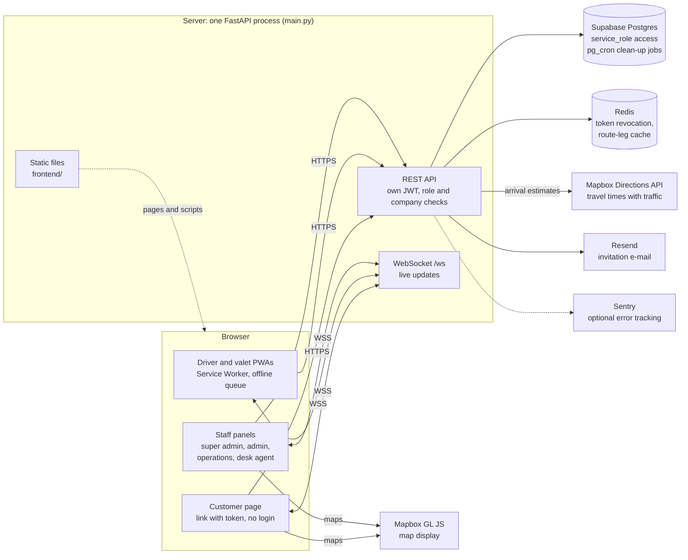
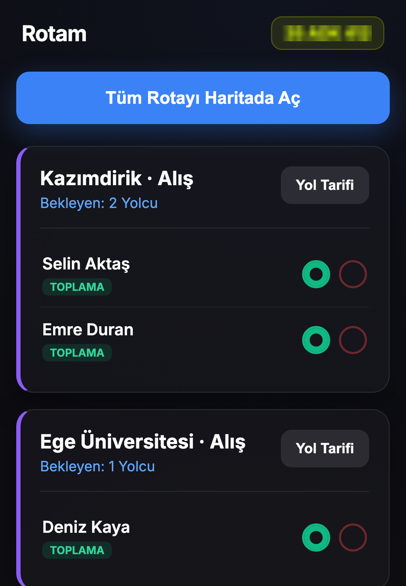
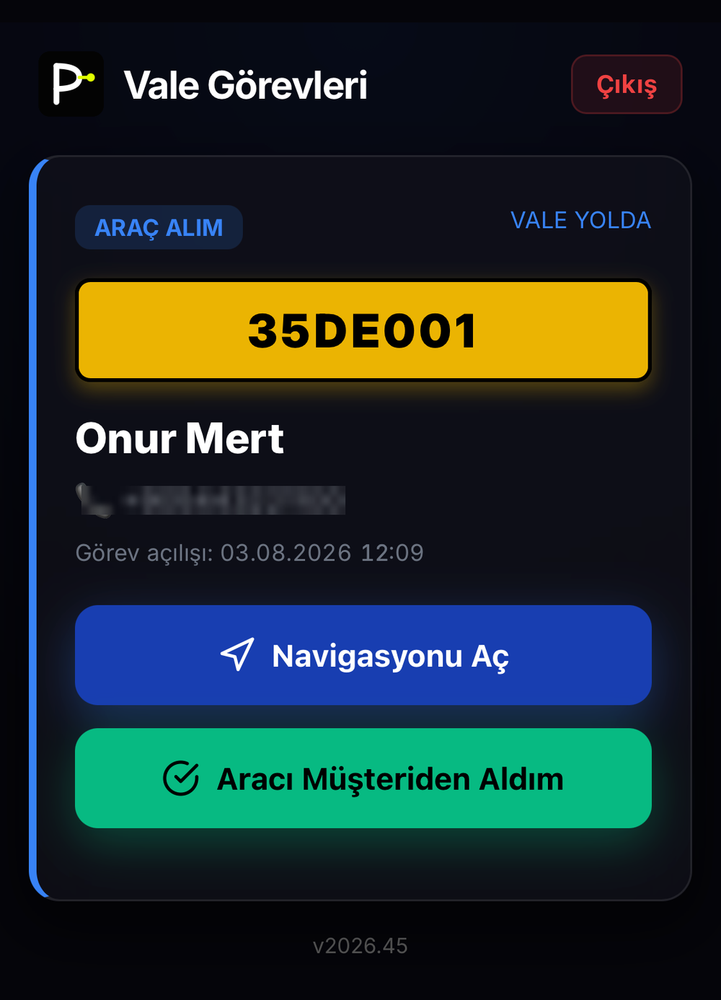
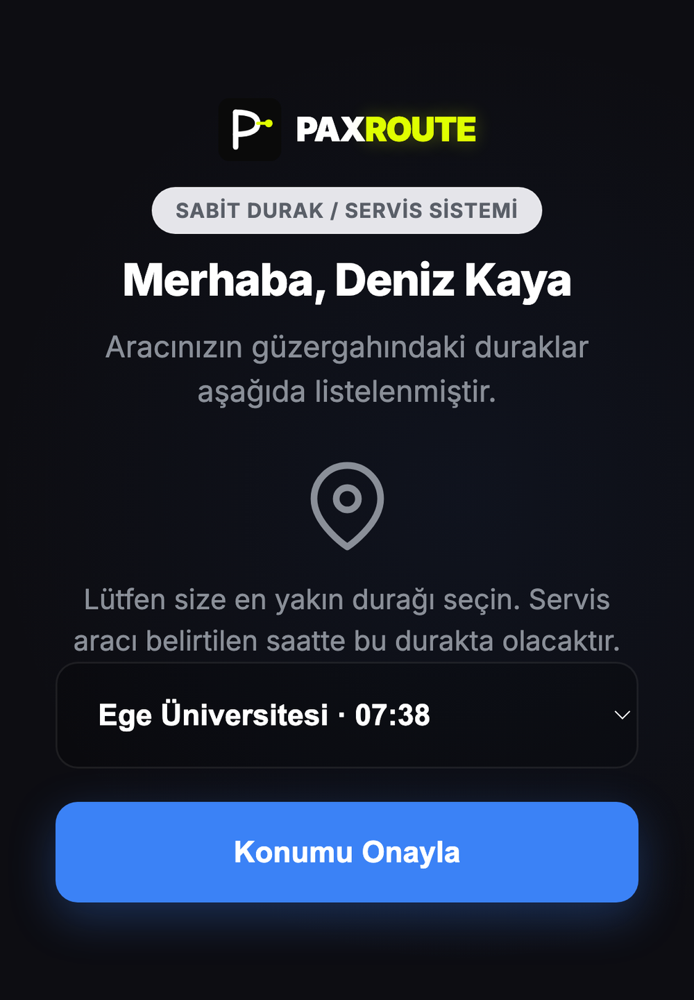
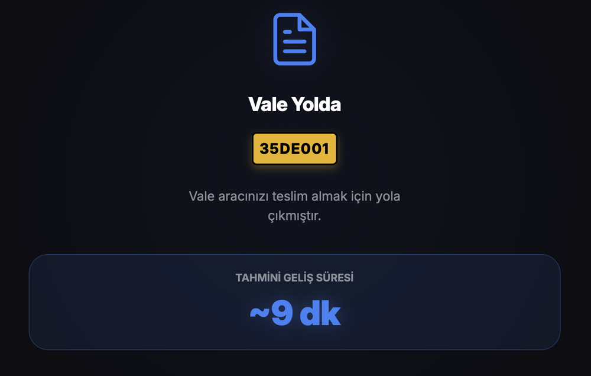
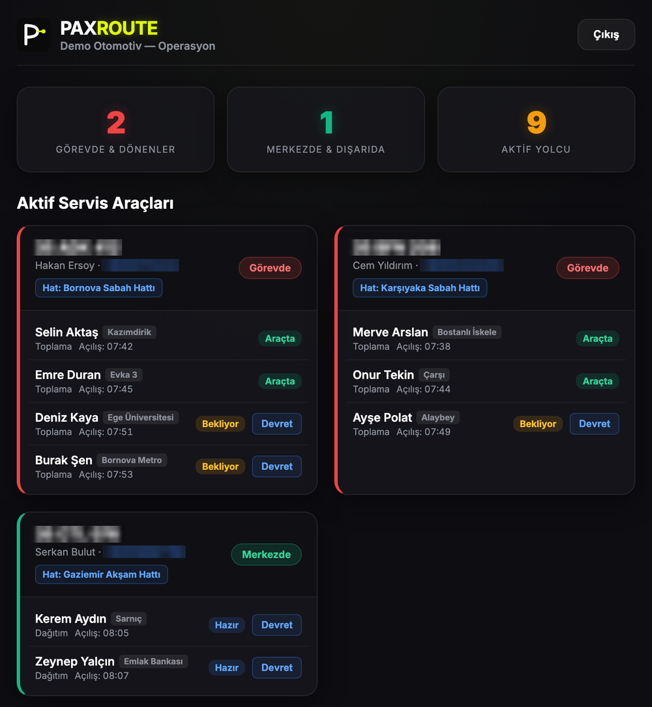
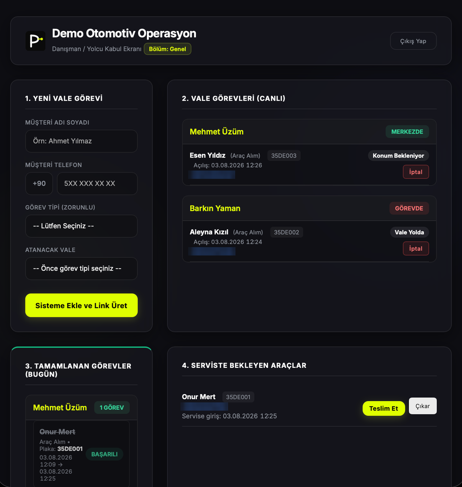
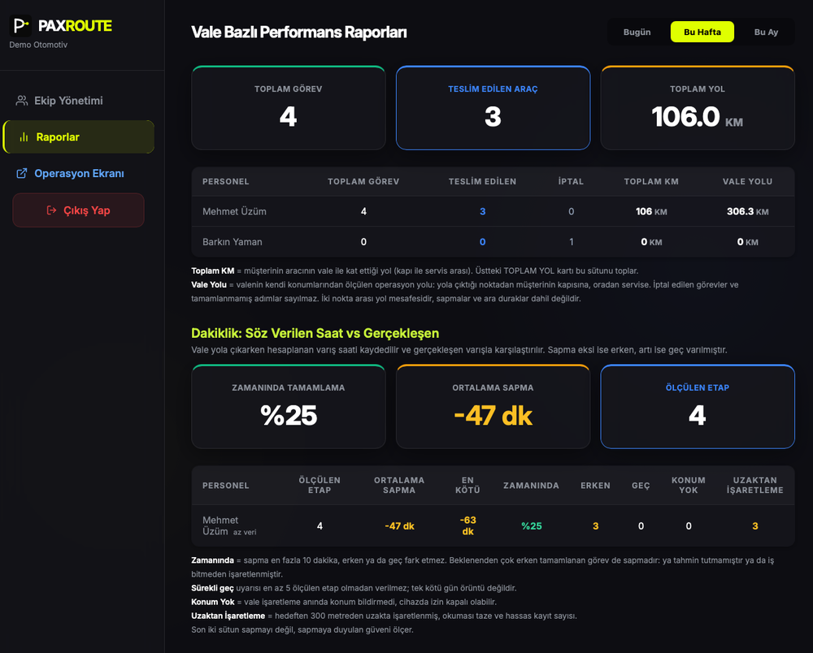

# Shuttle & Valet Ops

Built by Atıl Arslan under the Paxroute name, 2026.

**English** · [Deutsch](README.de.md)

A web application for running two kinds of transport operations. In shuttle, the driver gets an
ordered route and passengers see how many minutes away the vehicle is. In valet, a customer's car
is picked up from their door, taken to the service center and brought back to the door when the
job is done. In both modules the customer installs nothing: they mark their location or stop
through a link and see the arrival estimate. The company that runs the operation follows it from
a panel.

Both modules were brought to a working state on a production server:

- **Shuttle:** staff transport. Works with fixed stops and routes, or door to door; an ordered
  route for the driver, an arrival estimate for the passenger.
- **Valet:** a car is picked up from the customer's door, taken to the service center, and
  returned to the door when the job is done.

A company can use either one or both. The modules are switched on and off independently and
have separate quotas.

The product was built for the Turkish market: the interface is in Turkish, and personal data
handling follows KVKK, Turkey's data protection law. The code comments and this document are in
English; identifiers (variables, functions, tables, columns) are Turkish, as are the messages the
user sees.

This is a single-developer project. The repository was opened less to show the product than to
show the decisions behind it and their reasons. The sections below try to answer "why did we do
it this way" rather than "what did we do". Some of them describe things that were done wrong the
first time and fixed later; the reason for a decision often only became clear in that fix.

**Status:** solo project, developed 03.2026–10.2026. The product went live on a production server
and was demonstrated to prospective companies; no company used it in its operations, and it was shut
down because it did not find customers. The server is off, so there is no live instance to try. The
repository was published with a clean history for security: the code was copied into a new
repository, and the development history was not published.

Two good places to start: the [offline queue](#field-conditions-pwa-and-offline-queue) that keeps
work going when the connection drops in the field, and the
[valet state machine](#valet-flow-state-machine), whose order changes with the task type.

---

## Contents

1. [Technology](#technology)
2. [Architecture](#architecture)
3. [Screenshots](#screenshots)
4. [Project structure](#project-structure)
5. [Identity, authorization and isolation](#identity-authorization-and-isolation)
6. [Valet flow: state machine](#valet-flow-state-machine)
7. [Honest measurement](#honest-measurement)
8. [Shuttle: route ordering and arrival estimates](#shuttle-route-ordering-and-arrival-estimates)
9. [Field conditions: PWA and offline queue](#field-conditions-pwa-and-offline-queue)
10. [Consistency: idempotency instead of atomicity](#consistency-idempotency-instead-of-atomicity)
11. [Performance: cutting Redis traffic](#performance-cutting-redis-traffic)
12. [Security](#security)
13. [KVKK: data hygiene from day one](#kvkk-data-hygiene-from-day-one)
14. [What it does not do](#what-it-does-not-do)
15. [Known limitations](#known-limitations)
16. [Setup](#setup)
17. [License](#license)

---

## Technology

| Layer | Choice | Why |
|---|---|---|
| Backend | FastAPI (Python 3.12) | Async, validation through type hints, fast progress in one file |
| Database | Supabase (Postgres) | Managed Postgres; `pg_cron` for scheduled jobs |
| Identity | Own JWT system | Supabase Auth's model did not fit the role hierarchy and company isolation |
| Cache | Redis | Token revocation and company status checks, route durations |
| Real time | FastAPI WebSocket | No need for a separate service layer |
| Maps and routing | Mapbox (GL JS + Directions) | Travel times with traffic data |
| Frontend | Plain HTML + JavaScript | No build step |
| Field screens | PWA + Service Worker | Keep working out of coverage |
| XSS protection | DOMPurify (served locally) | No dependency on an external CDN |

---

## Architecture

Everything runs in one FastAPI process, which serves the API, the WebSocket and the front-end files.
The browser talks to Mapbox directly only to draw maps; travel times are requested by the server.



---

## Screenshots

The interface is in Turkish. The screenshots were taken from the live version, which ran under the Paxroute name; the name and logo were removed from this code base. They show demo data; phone numbers and licence plates are blurred.

| | |
|---|---|
| <br>**Driver (PWA):** ordered route | <br>**Valet (PWA):** current task |
| <br>**Customer:** choosing a stop | <br>**Customer:** arrival estimate |
| <br>**Operations panel** | <br>**Desk agent panel:** valet tasks |
| <br>**Reports:** promised vs actual times per valet (see [Honest measurement](#honest-measurement)) |  |

---

## Project structure

```
main.py                The whole backend: endpoints, authentication, helpers
requirements.txt
requirements-dev.txt   Test dependency (pytest)
tests/                 Tests for the pure helper functions and rule tables
frontend/
  <page>.html          One page per role
  js/<page>.js         That page's only script
  js/surum-kontrol.js  "New version" notice on the non-PWA panels
  config.js            Shared settings (API address, logout)
  sw.js                Service Worker; the single source of the version number
  manifest.json        PWA manifest
  libs/purify.min.js
  fonts/
db/                    Base schema, migrations and scheduled jobs (SQL)
```

Pages are split by role: super admin, company admin, operations, desk agent, driver, valet,
customer. The driver and valet screens are PWAs; the others are plain web panels.

### Why a single-file backend

The backend lives in one `main.py`. For a single developer, searching and editing one file was
faster than moving between modules. The main benefit of splitting a file is that several people
can work on it at once; that need never came up.

### Why no build step

There is one HTML and one JavaScript file per page; no framework and no bundler. The file that
runs is the file that was written. The price is duplicated code
([Known limitations](#known-limitations)).

---

## Identity, authorization and isolation

### Supabase, but not Supabase Auth

The database is Supabase; authentication is our own JWT system. The reason is a six-role
hierarchy and company isolation: every request has its role and its company checked separately,
and we needed full control over token revocation.

The backend connects to the database with the most privileged key; row level security does not
apply and all authorization checks live in application code. This is deliberate: the
authorization logic is not scattered across database policies but sits, readable, in the
application code.

### Role hierarchy

```
SUPER ADMIN  >  ADMIN  >  OPERATIONS  >  DESK AGENT  >  DRIVER = VALET
                                                        CUSTOMER (no login, token only)
```

A user can only manage someone below their own level. The one exception is delegation: an admin
can create another admin whose scope is narrower than their own (tied to a branch or a brand).
That is how headquarters creates a branch admin, and a branch admin creates a brand admin.

Driver and valet are field roles at the same level. Viewing, starting and finishing a route, stop
operations and passenger operations are only allowed on their own vehicle.

This rule was added later: an audit found that a valet could fetch the route list of the shuttle
vehicles in their own company and see passengers' personal data. Both field roles were tied to the
same "is this your vehicle" check. A later review found that the three passenger endpoints (picked
up, dropped off, no-show) still checked only the company, so a driver who knew a passenger's token
could mark a passenger of another vehicle; they now use the same check.

### Company isolation

For every role except super admin, a request is rejected if the company of the requested resource
does not match the company in the token. The check is not done in a single middleware but in each
endpoint, because the resources differ (request, vehicle, stop, route) and each is tied to its
company in a different way. The price is that it can be forgotten in one endpoint. That is exactly
what the audit found: a few endpoints were missing the check, and a user who knew the ID of a
record belonging to another company could read or change it (IDOR). All were brought into the same
pattern.

There are limits inside a company too. The desk agent and operations roles only see records of
their own brand and cannot create records for another brand. A user tied to a branch can only
change their own branch's records.

### Token lifetime and revocation

Tokens for the field roles (driver, valet) are valid for 7 days, all others for 24 hours. The field
lifetime is long because a driver being logged out mid-week stops the work, and operations waiting
in the offline queue can only be sent after logging in again.

Revocation covers three cases: revoking a single token (logout), invalidating all of a user's
tokens (password change, staff deletion) and deactivating a company. When a user or company is
deleted or deactivated, or a password is reset, their tokens are revoked too.

At first, revocation after a password change or staff deletion was kept only in Redis; if Redis
was flushed, revoked tokens would become valid again. Revocation is now also stored in the
database, and Redis is only an accelerator. Tokens of users in a deleted company also stayed valid
at first; a deleted company now counts as inactive.

Two places decoded the token by hand instead of going through the common check, and so skipped
part of it. The WebSocket checked only the company status, so a logged-out token could still
connect. A stop list endpoint that staff share with the customer page missed the per-user cutoff,
so a token issued before a password reset could still read it. Both now call the same check as
every other endpoint.

How these checks are made cheap on every request is covered under
[Performance](#performance-cutting-redis-traffic).

### Identity and display name are separate fields

The username is the identity: login, token revocation and every technical match use it. The display
name is for display: the name shown on screens and in reports, which may contain Turkish letters
and spaces.

Turkish letters are deliberately banned from usernames. Uniqueness is checked after lowercasing,
and Turkish case conversion makes that unreliable: lowercasing `İ` gives `i` followed by a
combining dot, while `I` becomes `i`. The result can be two different-looking usernames colliding
into the same identity, or two identical-looking names counted as different identities, and
neither raises an error.

So usernames accept ASCII only and are converted automatically as they are typed into forms.
Display names are not unique either: one company can have two people called "Mehmet Yılmaz".

### Time

All timestamps are stored in UTC. The panels do not take the time zone from the browser; they
always display in `Europe/Istanbul`, so a panel opened abroad shows the same time.

---

## Valet flow: state machine

A valet task has two types, and the order of states differs by type. In both types the task waits
in `BEKLIYOR_KONUM` until the customer marks their location through the link.

| Type | Order |
|---|---|
| Pickup (door to service center) | `KONUM_ALINDI_VALE` → `VALE_YOLDA` → `ARAC_ALINDI` → `TAMAM_SERVIS` |
| Delivery (service center to door) | `KONUM_ALINDI_VALE` → `ARAC_ALINDI` → `VALE_YOLDA` → `TAMAM_MUSTERI` |

`VALE_YOLDA` means the same in both types: the valet is on the way to the customer. The arrival
estimate the customer sees starts at exactly that moment.

At first there was one shared order. For deliveries this meant the arrival estimate started before
the car had even left the service center: the customer saw, say, "valet at your door in 12
minutes" while the car was still in the service car park. The meaning of each state was kept fixed
and the order was split by type.

The transitions are defined in a dictionary; a transition that is not allowed is rejected by the
server with `409`. The buttons on the valet screen follow the same order.

### Cancellation depends on the type

A task can only be cancelled before the car is picked up. The cancellable states were first a flat
list that included `VALE_YOLDA`. For pickups that was right: the car had not been picked up yet.
For deliveries, though, `VALE_YOLDA` meant the customer's car was in the valet's hands and on the
road. The task could still be cancelled, and since cancelling puts the car back on the "waiting at
the service center" list, the panel showed the car in the car park while it was on the road.

This was the same class of bug as the arrival estimate: the flat list did not see the reversed
order of deliveries. The cancellation rules were also turned into a per-type dictionary. The two
tables reference each other in the code, so that changing one prompts a look at the other.

### One task per valet at a time

The valet screen always shows a single task. While a second task could be assigned, that task never
appeared on the screen and waited in an invisible queue. Now, trying to open a new task for a valet
who already has an active one gets `409` from the server. The check has no date filter: an
unfinished task carried over from yesterday also counts as busy.

### Why a valet is a "vehicle"

The data model is vehicle-centric; on the shuttle side everything hangs off a vehicle. So whenever
a valet staff member is created, a virtual vehicle record is created behind the scenes. This is an
implementation detail and never appears on any screen; the valet is shown by name everywhere. When
a valet with history is deleted as staff, their virtual vehicle is not deleted, because past tasks
point to it; with no user left, it drops out of the operational lists.

---

## Honest measurement

Each leg of a valet task is recorded separately (going to the customer and returning to the service
center for pickups; service preparation and going to the customer for deliveries). For legs with a
target, the target arrival time calculated when the leg starts and the actual arrival time are
stored; the difference makes up the punctuality report.

But "actual arrival" is really the moment the valet presses the button. If the valet arrives and
presses six minutes later, human delay gets into the measurement. Since pressing habits vary from
person to person, that delay mixes with exactly the per-valet difference we want to measure.

So the valet's distance to the target is also recorded at the moment of pressing. What is stored is
not a coordinate but a distance in metres. Since distance alone is not proof, the age and accuracy
of the location reading are stored with it. The report counts presses made from far away
separately; if the reading is stale or uncertain, the record is not counted against the person.

Whether the valet shared their location is flagged separately. An empty distance field means
nothing on its own; the target coordinate may also be missing, for example if the customer withdrew
location permission.

---

## Shuttle: route ordering and arrival estimates

### The shape of a route

In stop mode, each route is classified when the admin finishes it. The distance of the middle stop
and of the last stop from the headquarters are compared:

- If the last stop is farther than the middle one, the route is linear (out and back).
- If the last stop is closer than the middle one, the route is a half moon (a loop).
- A route with two stops or fewer counts as linear.
- Older routes that were never classified keep working with the old behaviour; backward
  compatibility is preserved.

### Ordering

- **Linear:** first drop-offs from near to far, then pickups from far to near. The same physical
  stop is shown as two separate cards, one on the way out and one on the way back. With one card
  the driver would try to pick up on the way out a passenger meant for the way back.
- **Half moon:** all stops in their defined order, regardless of task type.
- **Door to door:** there are no stops; passengers are ordered by straight-line distance from the
  headquarters. First drop-offs from near to far, then pickups from far to near.

These rules are an own heuristic based on Haversine (great-circle) distances to the headquarters. No
solver or optimization algorithm is involved.

The route the driver sees and the order the passenger sees are computed with the same rules in two
separate places. In the code they reference each other; if one changes, the other must change too.

### Arrival estimate

From the vehicle's last known location, a cumulative travel time with traffic data is computed to
each upcoming stop, plus a fixed allowance per stop. The estimate is recomputed from scratch on
every request, not counted down from the previous value. Travel times between stops are cached for
15 minutes: keeping them longer would make the estimate stale as traffic changes, keeping them
shorter would raise the map API cost.

"Last known location" is a deliberate phrase. There is no continuous GPS tracking (see
[What it does not do](#what-it-does-not-do)); the location is updated with each of the driver's
actions.

---

## Field conditions: PWA and offline queue

The driver and valet screens are PWAs. A vehicle may be in an underground car park or out of
coverage, and the work goes on meanwhile.

### The queue

Write operations go through a single wrapper. If there is no connection or a network error occurs,
the operation is queued and sent when the connection comes back; the driver screen also flushes the
queue when the app opens. Operations that can only be done online (such as starting a route) are not
accepted at all while offline.

### The queue's one rule

When flushing the queue, both screens apply the same rule:

> **Only operations that could succeed later stay in the queue.**

- `401` stays: it will succeed once the user logs in again.
- `5xx` and network errors stay: they are temporary.
- Other `4xx` responses are dropped: they are a permanent refusal by the server. A cancelled task,
  a state that has already moved on, or a closed route will not become valid by retrying.

The two screens were wrong in opposite directions of this rule. One retried every `4xx` forever; an
update for a cancelled task got stuck in the queue. The other counted every response other than
`401` as "delivered" when flushing; on a temporary `500`, the queued operation was silently lost.
Flushing was brought into line with this rule on both.

The same rule applies to the first send of an operation: a temporary server error while online
queues passenger and stop operations. The driver screen has one deliberate exception: requests to
finish the route or change the vehicle status are not queued if their first send fails; the driver
is shown an error instead. A "finish route" request coming out of the queue late could close a new
route the driver had started in the meantime.

There was also an ordering problem with the last passenger: the passenger's operation and the
request to finish the route went out at the same time. If the route closed first, the passenger's
operation was rejected and the passenger was left unmarked. Now the passenger's operation is sent
and awaited first, and the route closes after it.

### Keeping state

The driver's route list is kept in the browser's persistent storage. It used to be in session
storage, and the list was lost when the app was closed and reopened or reloaded offline. The list
is deleted on logout and when the route ends, so no personal data is left on the device.

### Getting updates onto the device

The Service Worker serves from cache first; the app opens fast and works offline. The price is that
a new version does not reach the device on its own. The fix has three parts:

- The Service Worker file is served with headers telling the browser not to cache it; the browser
  (iOS included) asks the server for a new version every time.
- When a new version takes over, the page reloads itself.
- The version number is shown at the bottom of the screen; its source is a single constant in the
  Service Worker.

The non-PWA panels have no Service Worker, so a tab left open never picks up a new version. There, a
small script reads the version number periodically and, if it has changed, shows a "new version
released, reload" bar at the top. There is deliberately no automatic reload: someone filling in a
form should not lose what they typed.

---

## Consistency: idempotency instead of atomicity

Three flows that update more than one table (finishing a route, changing a vehicle's status,
completing a stop operation) do not run in a transaction. Supabase's client side does not offer
native transactions; that would have required a separate stored procedure for each flow.

Idempotency was provided instead: when the same request arrives twice, the second has no effect.
This is a weighed choice. Because of the offline queue, the same operation arriving twice is normal
in these flows; one stopping halfway is rare and can be fixed by hand. The frequent case was closed
first. The code states this limit explicitly in all three flows.

There is one exception: adding and deleting stops is done atomically by a function defined in the
database. There the situation was reversed: inserting a stop in the middle requires shifting the
sequence numbers of the stops after it, and two concurrent requests could corrupt that shift.
Inserting and shifting are done together in one database function, closing the race condition;
deletion also renumbers in the same place.

### Deletion and foreign keys

Anywhere a vehicle record is deleted, the task records tied to that vehicle must be considered:
either they are deleted first, or the operation is refused with a clear error message. This rule was
introduced after a `500` in production: deleting a valet with history ran into the database's foreign
key constraint.

---

## Performance: cutting Redis traffic

On every request, whether a token had been revoked was checked with three separate keys: the token
itself, all of the user's tokens, and the user's company. Since the screens poll the server at
intervals, the request count was high, and every request meant three Redis commands.

It was brought down in two steps:

1. The three keys are fetched with a single `MGET` command.
2. On top of that, an in-process memory cache: a token verified in the last 30 seconds never goes to
   Redis.

The second step raises a question: doesn't a 30-second cache delay revocation by 30 seconds? It does
not, because logout, password change and company deactivation clear the cache immediately. The cache
only speeds up the case where nothing has changed.

In a five-minute heavy test scenario, the number of Redis commands dropped from about 600 to 230.

---

## Security

The code base was audited end to end twice. Findings were closed in order of priority; two were
deferred with reasons (see [Known limitations](#known-limitations)). The decisions below come from
those audits or from a problem met in production. Company isolation and token revocation are covered
above, under [Identity, authorization and isolation](#identity-authorization-and-isolation).

### Unused endpoints were removed

Endpoints that no screen called were removed rather than fixed: four at first, and later a fifth,
left over from an abandoned continuous location tracking design (see
[What it does not do](#what-it-does-not-do)).

### Rules live on the server

A button disabled on screen can be bypassed with a direct API request. That is why rules such as "no
passenger operations before the route is started" are also enforced on the server. Password rules
(length, letters and digits) are also checked on the server; the check in the browser is only for
the user's convenience.

### Passwords

Passwords are stored with bcrypt; new users set their own password through an invitation link. The
link is generated by the server, not the interface: the interface only sends the username, and the
target address is read from the database. Invitation links are valid for 7 days.

There was a Turkish-specific trap here: bcrypt does not accept input longer than 72 bytes, and
Turkish letters take 2 bytes in UTF-8. A form limiting by character count could let through a
password over the byte limit, and the server returned `500`. The limit is now checked in bytes.

### Error messages

Internal error text from the database is not passed to the client. The user sees a generic message
and the details go to error monitoring. This rule was introduced after errors containing schema
details were seen going straight to the client from two endpoints.

Server-side messages go through Python's `logging` module, never `print`, and contain no personal
data: an email that was sent is logged as sent, without the address. Records at ERROR level also
reach error monitoring. Where an exception is deliberately ignored (a failed cache write, for
example), the code says why that is safe.

### Audit log

Critical operations such as deletion, password reset, adding staff, assigning vehicles and
deactivating a company are logged together with who did them; so are failed login attempts. The log
records events, not content: for a password reset the password itself, and for a contact details
update the new values, are not written; only which field was filled in is recorded.

The IP address in the audit and consent logs is the one the reverse proxy reports to the
application server. The `X-Forwarded-For` header is not read directly: its first entry is whatever
the client sent, which would let anyone write a fake address into the consent log.

### Other protections

Automatic API documentation is off in production. CORS only allows the application's own address.
If one of the critical environment variables is missing, the server stops at startup. Request bodies
are received through typed models; fields such as role, task type, vehicle type and status are
validated against fixed lists, and names and plates against allowed character lists. Coordinates go
through range checks; (0, 0) is also rejected for chosen locations, because in practice it means
"location could not be obtained". At most 100 passengers can be processed at a single stop.

The WebSocket has total and per-identity connection limits; a connection that sends no token is
closed within 10 seconds. A staff token goes through the same revocation checks as on the REST
endpoints, so a logged-out or revoked token, or a user of a deactivated company, cannot connect.

On every page the content security policy forbids inline scripts; the relaxation required by the map
library is only enabled on pages with a map. User content passes through DOMPurify before it is
written to the screen, and email bodies are HTML-escaped.

The login and password-setting endpoints are protected with per-minute request limits; so are the
main endpoints of the customer page. Tokens in customer links are 128-bit random values.

---

## KVKK: data hygiene from day one

KVKK is Turkey's personal data protection law.

In a valet task, the customer's location is deleted the moment it stops being useful:

- For pickups, as soon as the valet takes the car from the customer. The location is no longer
  needed.
- For deliveries, as soon as the car is handed over to the customer.

If the customer withdraws location permission, the location is deleted at that moment. The location
of shuttle passengers, along with name, phone and plate, is kept because it is needed while the work
is ongoing and in reports; a database job that runs every day deletes all request records older than
30 days.

Customer links have a limited lifetime: 12 hours for shuttle (the trip ends the same day), 72 hours
for valet (the car may stay at the service center for days). This is only a safety net; the link is
mainly invalidated when the work is done. There are two exceptions. For a valet pickup, the link
lives until the delivery task is opened, so the customer can see that the car is at the service
center. After a valet delivery, the link lives for 24 more hours, but it only opens the satisfaction
survey and returns no name, phone, plate or location; the link dies when the survey is sent or the
time runs out.

Every endpoint a customer link can reach enforces the lifetime: the tracking page, the queue
position, the stop list, the WebSocket and both location submissions. At first only the tracking
page did, so an expired link could still read its place in the queue or even submit a location.
Refusing and withdrawing consent stay possible after expiry on purpose: they only reduce the data
held, and the right to withdraw consent should not depend on a link's age.

Consent records: every time the privacy notice or consent text changes, the text version is bumped,
and that version is stored with each consent. That way the question "which text did this person
consent to" can still be answered years later. Forgetting to bump the version makes old consents look
as if they were given to the new text.

---

## What it does not do

- **No artificial intelligence.** Route ordering is done with geometric and heuristic rules; traffic
  data comes from an external API. Solver-based optimization (OR-Tools and the like) is not in this
  code base.
- **No continuous live GPS tracking.** A browser does not produce location continuously in the
  background; iOS suspends the app, Android freezes it, and a Service Worker has no access to
  location. The location is updated with each of the user's actions. The product does not keep a live
  trail; it produces timestamped records and arrival estimates. Continuous location would only be
  possible with a native app.
- **No SMS.** Links are shared by hand.
- **No native mobile app.** Everything is web and PWA.
- **The customer does not see a vehicle moving on a live map;** they see the arrival estimate.

---

## Known limitations

- **The backend is a single file.** It was not split because there was no second developer.
- **Test coverage is narrow.** The small pytest suite in `tests/` covers only the pure helper
  functions and rule tables. Endpoints and the flows that write to the database were tested by hand
  on the running system and have no automated tests.
- **No CI/CD.** Deployment was manual: files were copied to the server and the service was restarted.
- **Three flows are not atomic** (see [Consistency](#consistency-idempotency-instead-of-atomicity)).
  Full atomicity would need stored procedures.
- **There is duplicated code:** the valet cancellation rules are defined on the server and in the
  scripts of two panels, and the transition order again in the valet screen's buttons; the driver's
  route and the passenger order are computed in two separate places on the server; the time display
  function is identical in four files. Part of this is the price of having no build step. When
  changing any of them, all must change together; these places are marked in the code.
- **A `401` on the first send is not queued.** The queue rule says `401` stays in the queue, and that
  is what happens when the queue is flushed. But if the session has expired when an operation is first
  sent, both field screens redirect the user to the login screen and that operation may be lost.
- **Two audit findings were deferred:**
  - The route start endpoint changes state but is called with `GET`. Since authentication uses a
    `Bearer` token rather than a cookie, this does not create a CSRF hole; moving to `POST` was
    deferred because it requires changing client and server together. Coordinate validation was added.
  - The database client runs synchronously; its effect under load has not been measured.

---

## Setup

Requirements: Python 3.12, a Supabase (Postgres) project, Redis, a Mapbox account, and a Resend
account for sending email.

```bash
python3.12 -m venv .venv && source .venv/bin/activate
pip install -r requirements.txt
cp .env.example .env    # fill in the values
uvicorn main:app --reload
```

`.env` expects the JWT signing key, the database, Redis, map and email provider keys, and the
application's address (`BASE_URL`); each is explained in `.env.example`. If one is missing, the
server does not start. If `BASE_URL` starts with `https://`, the application runs in production mode
and does not allow local addresses through CORS; use `http://localhost:8000` locally.

The backend also serves the `frontend/` folder itself; the application opens at
`http://localhost:8000`. The frontend calls the API at the address the page was opened from, so no
separate setting is needed.

For the map pages, the browser-side Mapbox token sits as a placeholder in `frontend/js/admin.js` and
`frontend/js/musteri.js`, and the email sender address in `main.py`; replace them with your own
values. The Content-Security-Policy line at the top of each page in `frontend/` allows
`https://YOUR_DOMAIN` and `wss://YOUR_DOMAIN`; replace `YOUR_DOMAIN` with the domain the
application is served from.

Database: run `db/00_temel_sema.sql` once in the Supabase SQL editor; it creates every table and the
stop insert/delete functions. Then enable the `pg_cron` extension and run the scheduled clean-up jobs
in `db/kvkk_temizlik.sql` (two jobs), `db/kvkk_riza.sql` and `db/memnuniyet_anketleri.sql`. The other
files under `db/` are migrations for older databases and are already included in the base schema.

The privacy notice pages are not included in this repository, because they contained a real
company's legal details. The customer page links to `frontend/kvkk/aydinlatma-yolcu.html` and the
password page to `frontend/kvkk/aydinlatma-personel.html`; put your own notices at those paths.

In production, run the application behind a reverse proxy (such as nginx) on the same machine. The
proxy must send `X-Forwarded-For`; uvicorn trusts that header only from 127.0.0.1 by default
(`--forwarded-allow-ips`) and passes the real client address on to the application, where the rate
limits and the audit and consent logs use it.

Error monitoring is optional: it is enabled if `SENTRY_DSN` is set and disabled otherwise.

Tests: `pip install -r requirements-dev.txt`, then `pytest`. They use dummy settings and need no
database, Redis or external service. They cover distance, input validation, the role hierarchy,
customer link lifetimes, the valet state machine and its cancellation rule, token lifetimes and
password hashing.

---

## License

All rights reserved. The code is published for viewing as a portfolio; see `LICENSE`. Third-party
components keep their own licenses.
