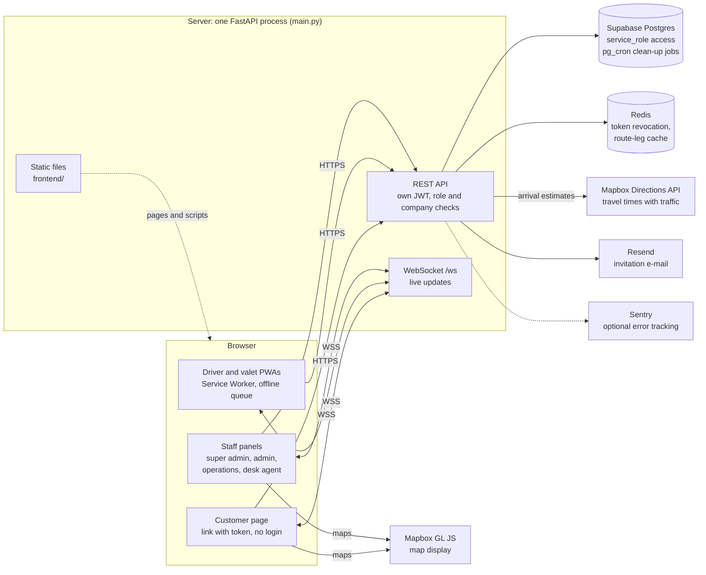

# Shuttle & Valet Ops

[](https://github.com/atilbarslan/shuttle-valet-ops/actions/workflows/ci.yml)

Built by Atıl Arslan under the Paxroute name, 2026.

**English** · [Deutsch](README.de.md)

A web application for running two kinds of transport operations. In shuttle, the driver gets an
ordered route and passengers see how many minutes away the vehicle is. In valet, a customer's car
is picked up from their door, taken to the service center and brought back to the door when the
job is done. In both modules the customer installs nothing: they mark their location or stop
through a link and see the arrival estimate. The company that runs the operation follows it from
a panel.

Both modules were brought to a working state on a production server:

- **Shuttle:** staff transport. Works with fixed stops and routes, or door to door; an ordered
  route for the driver, an arrival estimate for the passenger.
- **Valet:** a car is picked up from the customer's door, taken to the service center, and
  returned to the door when the job is done.

A company can use either one or both. The modules are switched on and off independently and
have separate quotas.

The product was built for the Turkish market: the interface is in Turkish, and personal data
handling follows KVKK, Turkey's data protection law. The code comments and this document are in
English; identifiers (variables, functions, tables, columns) are Turkish, as are the messages the
user sees.

This is a single-developer project. The repository was opened less to show the product than to show
the decisions behind it and their reasons. The documents under `docs/` try to answer "why did we do
it this way" rather than "what did we do". Some of them describe things that were done wrong the
first time and fixed later; the reason for a decision often only became clear in that fix.

**Status:** solo project, developed 03.2026–10.2026. The product went live on a production server
and was demonstrated to prospective companies; no company used it in its operations, and it was shut
down because it did not find customers. The server is off, so there is no live instance to try. The
repository was published with a clean history for security: the code was copied into a new
repository, and the development history was not published.

## Screenshots

The interface is in Turkish. The screenshots were taken from the live version, which ran under the Paxroute name; the name and logo were removed from this code base. They show demo data; phone numbers and licence plates are blurred.

| | |
|---|---|
| <br>**Driver (PWA):** ordered route | <br>**Valet (PWA):** current task |
| <br>**Customer:** choosing a stop | <br>**Customer:** arrival estimate |
| <br>**Operations panel** | <br>**Desk agent panel:** valet tasks |
| <br>**Reports:** promised vs actual times per valet (see [Honest measurement](docs/DECISIONS.md#honest-measurement)) |  |

---

## Architecture

Everything runs in one FastAPI process, which serves the API, the WebSocket and the front-end files.
The browser talks to Mapbox directly only to draw maps; travel times are requested by the server.



---

## Technology

| Layer | Choice | Why |
|---|---|---|
| Backend | FastAPI (Python 3.12) | Async, validation through type hints, fast progress in one file |
| Database | Supabase (Postgres) | Managed Postgres; `pg_cron` for scheduled jobs |
| Identity | Own JWT system | Supabase Auth's model did not fit the role hierarchy and company isolation |
| Cache | Redis | Token revocation and company status checks, route durations |
| Real time | FastAPI WebSocket | No need for a separate service layer |
| Maps and routing | Mapbox (GL JS + Directions) | Travel times with traffic data |
| Frontend | Plain HTML + JavaScript | No build step |
| Field screens | PWA + Service Worker | Keep working out of coverage |
| XSS protection | DOMPurify (served locally) | No dependency on an external CDN |

---

## Running it locally

Requirements: Python 3.12, a Supabase (Postgres) project, Redis, a Mapbox account, and a Resend
account for sending email.

```bash
python3.12 -m venv .venv && source .venv/bin/activate
pip install -r requirements.txt
cp .env.example .env    # fill in the values
uvicorn main:app --reload
```

The database schema, scheduled jobs, privacy notice pages, production notes and tests are covered in [docs/SETUP.md](docs/SETUP.md).

---

## Documentation

| Document | What is in it |
|---|---|
| [docs/ARCHITECTURE.md](docs/ARCHITECTURE.md) | Code layout, valet state machine, shuttle route ordering and arrival estimates, offline queue, consistency, Redis traffic |
| [docs/DECISIONS.md](docs/DECISIONS.md) | Why it was built this way, honest measurement, what it deliberately does not do, known limitations |
| [docs/SECURITY-PRIVACY.md](docs/SECURITY-PRIVACY.md) | Identity and isolation, security measures, what fails open and what fails closed, KVKK data handling |
| [docs/SETUP.md](docs/SETUP.md) | Full setup: environment, database, privacy notice pages, production, tests |
| [docs/PERFORMANCE.md](docs/PERFORMANCE.md) | Load test of the blocking database calls, before and after the fix |

Two good places to start: the [offline queue](docs/ARCHITECTURE.md#field-conditions-pwa-and-offline-queue) that keeps
work going when the connection drops in the field, and the
[valet state machine](docs/ARCHITECTURE.md#valet-flow-state-machine), whose order changes with the task type.

---

## License

All rights reserved. The code is published for viewing as a portfolio; see `LICENSE`. Third-party
components keep their own licenses.
